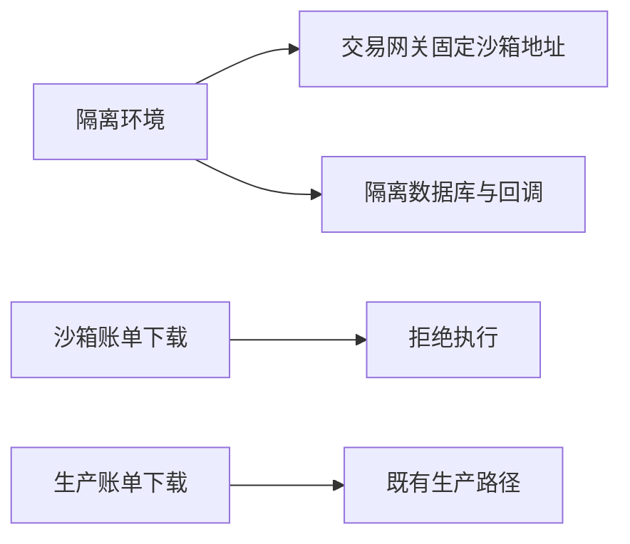

# 支付宝沙箱隔离设计

```mermaid
flowchart LR
  A[隔离环境] --> B[交易网关固定沙箱地址]
  A --> C[隔离数据库与回调]
  D[沙箱账单下载] --> E[拒绝执行]
  F[生产账单下载] --> G[既有生产路径]
```

本次在账单服务和 API 双层拒绝沙箱账单下载，服务检查在组装和发送请求前，API 检查在读取密钥前。生产模式保持原有流程。未验证沙箱账单能力前不放宽地址白名单。
