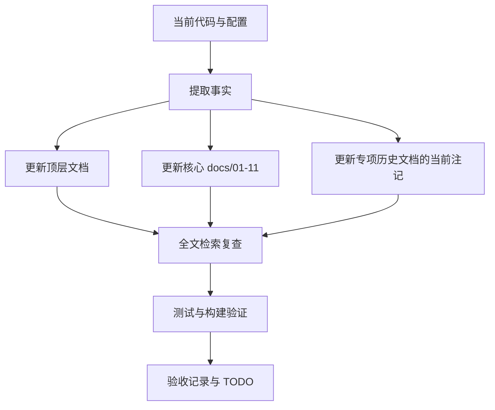

# DESIGN_文档项目对齐

## 1. 对齐策略

## 2. 权威来源

| 信息 | 权威来源 |
| --- | --- |
| API 数量 | `app.main:app.routes` |
| Agent 数量 | `get_orchestrator()._registry.list_runtime()` |
| 表结构 | `deploy/mysql/init.sql` + `backend/app/models` |
| 前端页面/API/类型/组件数量 | `frontend/src` 实际文件 |
| 部署入口 | `deploy/docker-compose.yml`, `deploy/deploy.sh`, `frontend/nginx.conf`, `dev.sh` |
| 测试结果 | 当前命令输出 |

## 3. 异常处理

如果历史文档记录的是当时阶段结果,不删除历史事实;通过“当前状态补充”或“当前基线”说明最新口径。
