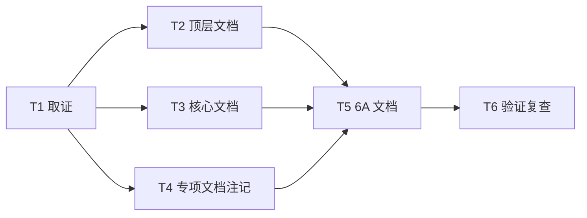

# TASK_文档项目对齐

## 任务拆分

| 任务 | 输入 | 输出 | 验收 |
| --- | --- | --- | --- |
| T1 取证 | 当前工作区 | API/Agent/表/前端模块/测试事实 | 命令可复现 |
| T2 顶层文档 | README、说明文档 | 当前目录和数量口径 | 不再出现误导性旧数量 |
| T3 核心文档 | docs/01-11 | 需求、设计、API、部署、测试同步 | 与代码实现一致 |
| T4 专项文档注记 | v2/v3/回归专项文档 | 当前状态补充 | 历史语境清楚 |
| T5 任务文档 | 本次对齐过程 | 6A 文档 | 文档齐全 |
| T6 验证复查 | 更新后文档 | 测试、构建、搜索复查结果 | 通过或记录剩余问题 |
