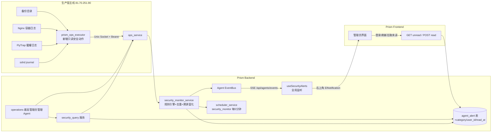

# DESIGN：最高管理员管理 Agent（安全监控与主动告警）

> 基于 ALIGNMENT 文档与用户 2026-08-05 确认：扩展 operations Agent；被动溯源；执行器只读采集；右上角弹窗+离线持久化+Agent 可查询（不建管理页）；备份 14 天 + 手工产物 30 天；本轮本地开发+测试，生产部署等干净 commit/CI。

## 一、整体架构



## 二、分层设计

1. **采集层（执行器只读动作）**：`prism_ops_executor.py` 新增 5 个只读动作，全部为固定命令 + 严格参数校验，不改任何服务器配置。
2. **契约层（ops_service）**：新增 5 个动作注册（risk=low、read_only），并放开 `source="scheduler"` 的无交互身份只读调用（新增 `SCHEDULER_READ_ACTIONS`），交互调用仍要求唯一超级管理员。
3. **检测层（security_monitor_service）**：定时拉取事件 → 规则聚合 → 去重 → 生成 `AgentAlert` → SSE 推送。
4. **查询层（security_query 服务 + API + 能力注册）**：供 Agent 聊天与前端弹窗查询；Agent 通过 `admin_execute_capability` 调用（复用固定能力注册表）。
5. **通知层（前端）**：全局 composable 订阅 SSE `admin_alert` 事件 + 登录拉取未读，右上角 `ElNotification` 弹窗；不新增管理页。

## 三、执行器新增动作契约（只读，risk=low）

| action | 参数 | 返回要点 |
| --- | --- | --- |
| `ssh_login_events` | `since_hours`(1-720,int), `limit`(1-5000,int), `focus`(enum accepted/failed/all, 默认 all) | 聚合：accepted 按 IP/密钥指纹计数、failed 按 IP 计数；最近条目(时间/IP/用户/事件) |
| `flytrap_attack_events` | `since_hours`(1-720), `limit`(1-5000) | journalctl flytrap-agent 解析 JSON：username/remote/时间/消息；按 remote 聚合计数 |
| `nginx_attack_events` | `since_hours`(1-720), `limit`(1-5000) | docker logs cr_frontend 指纹：CONNECT 代理探测、TLS 乱码探测、400/403 突发；按 IP 聚合 |
| `backup_audit` | 无 | 备份目录：文件数、总大小、最新/最老备份、超龄数量、校验文件缺失数、meta 摘要 |
| `ip_attribution` | `ip`(合法 IPv4/IPv6) | 被动溯源：固定调用 ip-api.com（country/regionName/isp/org/as），失败返回错误摘要 |

- 执行器内实现**解析纯函数**（`parse_ssh_log`/`parse_flytrap_log`/`parse_nginx_log`），便于单测。
- `ip_attribution` 使用固定 URL 前缀 + `ipaddress` 模块校验，禁止任意 URL；超时 15s、allow_failure。
- 所有动作遵守现有脱敏规则（不输出密码/私钥内容；SSH 日志只输出用户/IP/指纹）。

## 四、检测规则（security_monitor_service，阈值全部进配置）

| 规则 | 触发 | 严重度 | 类别 |
| --- | --- | --- | --- |
| SSH 成功登录（非白名单 IP） | 每次 | high（弹窗） | login |
| SSH 成功登录（白名单 IP） | 每次 | info（记录，不弹窗） | login |
| SSH 失败爆破 | 同 IP ≥ `failed_login_threshold`(默认20)/窗口(默认1h) | warning（弹窗） | brute_force |
| 蜜罐触碰 | 同 IP ≥ `flytrap_threshold`(默认10)/窗口(默认1h) | warning（弹窗） | attack |
| Nginx CONNECT 代理探测 | 出现即记 | info（不弹窗） | proxy_abuse |
| TLS/乱码探测突发 | 同 IP ≥ 5/窗口 | info | scanner |
| 备份超龄 | age > `backup_max_age_hours`(默认30) | high（弹窗） | backup |
| 备份校验缺失/损坏 | 检测到 | critical（弹窗） | backup |
| 备份目录过大 | > `backup_dir_max_gb`(默认10) | warning（弹窗，含清理建议） | backup |
| 磁盘 ≥ 80% / Swap 高 | 巡检数据 | warning/info（弹窗/记录+建议） | optimization |
| 镜像/发布产物堆积 | 手动或每日 | info（建议） | optimization |

- **去重**：`(category, fingerprint_key)` 相同的 open 告警不重复创建；detail 更新 last_seen。
- **SSE**：severity ≥ warning 时 emit `AgentEventType.ADMIN_ALERT`（新增枚举 `admin_alert`），`user_id=唯一超级管理员`；info 只入库可查询。
- **溯源富化**：对高危来源 IP 调用 `ip_attribution`，把 country/isp/as 写入 detail。

## 五、数据模型（Alembic 027 扩展 agent_alert）

```text
agent_alert 新增列:
  category    String(40)  nullable  # login/brute_force/attack/proxy_abuse/scanner/backup/optimization/penetration/data_leak/server
  source      String(40)  nullable  # security_monitor / manual / agent
  user_id     BigInteger  nullable  # 接收弹窗的目标管理员(唯一超级管理员), FK users.id
  read_at     DateTime    nullable  # 弹窗已读时间
索引: ix_agent_alert_user_read (user_id, read_at)
```

## 六、API 契约（新增，全部 require_super_admin/require_admin）

| 方法/路径 | 说明 |
| --- | --- |
| `GET /api/v1/agent-governance/observability/alerts/unread` | 当前管理员未读弹窗告警（status=open 且 read_at IS NULL） |
| `POST /api/v1/agent-governance/observability/alerts/{id}/read` | 标记已读（校验归属） |
| `POST /api/v1/agent-governance/observability/security/run-monitor` | 手动触发一轮安全巡检（供 Agent/运维用） |
| `GET /api/v1/agent-governance/observability/security/status?since_hours=` | 安全态势聚合（登录/攻击/备份/建议） |

- `admin_capability_registry.py` 新增 4 条能力：`observability.security.unread`、`observability.security.read`、`observability.security.run_monitor`、`observability.security.status`（page=`/admin/observability`，risk=READ/CRITICAL(手动巡检为 WRITE)）。
- 前端通过 `/api/...` 拉取未读；Agent 通过 `admin_execute_capability` 调用（自动获得 OpenAPI 参数契约）。

## 七、调度

- `scheduler_service._DEFAULT_JOBS` 新增 `("security_monitor", "security_monitor", "operations", "interval@5m")`。
- `SUPER_ADMIN_JOB_TYPES` 增加 `security_monitor`。
- `run_job` 分发到 `_execute_security_monitor` → `security_monitor_service.run_security_monitor(db, job)`。
- 配置项：`SECURITY_MONITOR_ENABLED`、`SECURITY_MONITOR_INTERVAL_MINUTES`、`SECURITY_SSH_ALLOWLIST_CIDRS`、`SECURITY_FAILED_LOGIN_THRESHOLD`、`SECURITY_FLYTRAP_THRESHOLD`、`SECURITY_BACKUP_MAX_AGE_HOURS`、`SECURITY_BACKUP_DIR_MAX_GB`、`SECURITY_POPUP_MIN_SEVERITY`、`THREAT_INTEL_BASE_URL`。

## 八、Agent 升级（operations → 最高管理员管理 Agent）

- `operations_agent.py`：description 增加"安全监控/攻击溯源/备份治理/优化建议"；skills 增加对应项；system_prompt 增加"发现安全事件必须汇报并给出解决建议，只依据真实工具结果"。
- `contracts.py` operations 契约同步更新 mission/skills/responsibilities。

## 九、前端弹窗

- `src/api/securityAlerts.ts`：`fetchUnreadAlerts()` / `markAlertRead(id)`。
- `src/composables/useSecurityAlerts.ts`：
  - 登录且为 admin/super_admin 时启动；`subscribeAgentEvents` 监听 `admin_alert`；
  - 启动时拉取未读 → 队列逐个弹 `ElNotification`（critical=error/warning/high=warning/info=info），弹出即标记已读；
  - 去重：sessionStorage 记录已弹 id；同 id 不重复弹。
- `App.vue` 挂载 composable（全局），不新增页面。

## 十、安全边界

- 只读动作不改服务器任何配置；写动作（备份清理）继续走既有审批（critical 需"确认执行"）。
- 不做主动反打；`ip_attribution` 仅被动查询公开情报。
- 非本项目服务只读盘点。
- 所有动作沿用现有审计脱敏；告警 detail 不存密码/密钥。

## 十一、验收口径

- 执行器 5 个动作在本地（mock journal/日志文件）单测通过；参数越界/非法 IP 被拒。
- `security_monitor_service` 规则/去重/SSE 单测通过；手动 run-monitor 可生成告警。
- 未读/已读 API 与能力注册通过契约测试；OpenAPI 基线更新（generate_project_facts.py）。
- 前端 composable vitest 通过：未读拉取+弹窗+去重+SSE 事件。
- Alembic 027 迁移在 SQLite/MySQL 通过；Agent 契约/技能更新后现有 Agent 测试不回归。
- 生产部署（干净 commit 后）：同步执行器、迁移、重建 Backend/Frontend，验收弹窗与告警闭环。
