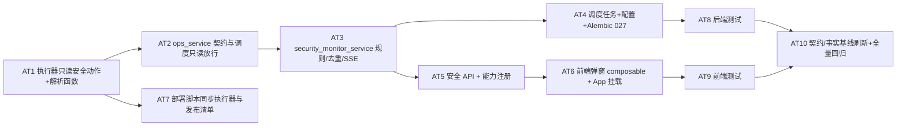

# TASK：最高管理员管理 Agent（安全监控与主动告警）

## 依赖图

## 原子任务

### AT1 执行器只读安全动作（deploy/prism_ops_executor.py）
- 输入契约：现有执行器结构、ACTION_PARAM_KEYS、run()。
- 输出契约：5 个动作（ssh_login_events/flytrap_attack_events/nginx_attack_events/backup_audit/ip_attribution）+ 3 个解析纯函数。
- 验收：单测覆盖解析与参数校验；非法 since_hours/limit/IP 拒绝；不改服务器配置。
- 依赖：无。后置：AT2/AT7。

### AT2 ops_service 契约（backend/app/services/ops_service.py）
- 输入契约：AT1 动作清单。
- 输出契约：ACTION_RISKS/READ_ONLY_ACTIONS/ACTION_PARAM_KEYS/ACTION_REQUIRED_PARAMS/ACTION_PARAM_TYPES/schema 增加 5 动作；新增 `SCHEDULER_READ_ACTIONS`（source=scheduler 且 actor=None 时放行，交互仍须超级管理员）。
- 验收：参数校验单测通过；无交互身份仅可调 SCHEDULER_READ_ACTIONS。
- 依赖：AT1。后置：AT3/AT5。

### AT3 security_monitor_service（backend/app/services/security_monitor_service.py）
- 输入契约：AT2；AgentAlert 模型；event_bus；observability_service.create_alert。
- 输出契约：run_security_monitor / query_security_status / 规则表 / 去重 / SSE emit(admin_alert)。
- 验收：单测覆盖规则触发、去重、SSE、白名单、阈值。
- 依赖：AT2。后置：AT4/AT5。

### AT4 调度+配置+迁移
- scheduler_service 默认任务与分发；config.py 新增配置；alembic 027 扩展 agent_alert（category/source/user_id/read_at+索引）。
- 验收：迁移在 sqlite+mysql 通过；调度注册正确。
- 依赖：AT3。后置：AT8。

### AT5 安全 API + 能力注册
- agent_governance.py（或新 admin_security.py）新增 4 个端点；admin_capability_registry.py 新增 4 条能力；AgentEventType 新增 admin_alert。
- 验收：OpenAPI 生成成功；能力契约测试通过；超级管理员可调、普通管理员被拒。
- 依赖：AT2/AT3。后置：AT6。

### AT6 前端弹窗（frontend/src）
- api/securityAlerts.ts + composables/useSecurityAlerts.ts + App.vue 挂载 + ElNotification 弹窗 + 未读拉取/已读标记/去重。
- 验收：vitest 覆盖；不新增页面；仅 admin 生效。
- 依赖：AT5。后置：AT9。

### AT7 部署同步（deploy/）
- deploy.sh 文件清单包含 prism_ops_executor.py（如缺失）；RELEASE_CHECKLIST.md 增加执行器同步与安全监控验收步骤。
- 验收：脚本测试通过；清单更新。
- 依赖：AT1。后置：AT8。

### AT8 后端测试
- 新增/更新后端单测（security_monitor、ops_service、API、迁移）；全量 pytest + ruff + compileall。
- 依赖：AT4/AT7。后置：AT10。

### AT9 前端测试
- composable vitest + 构建。
- 依赖：AT6。后置：AT10。

### AT10 契约/事实基线刷新与全量回归
- scripts/generate_project_facts.py（OpenAPI/事实）、check_openapi_contract.py、deploy/tests/test_scripts.sh、前端 lint/build。
- 依赖：AT8/AT9。后置：ACCETANCE/FINAL/TODO 文档。
