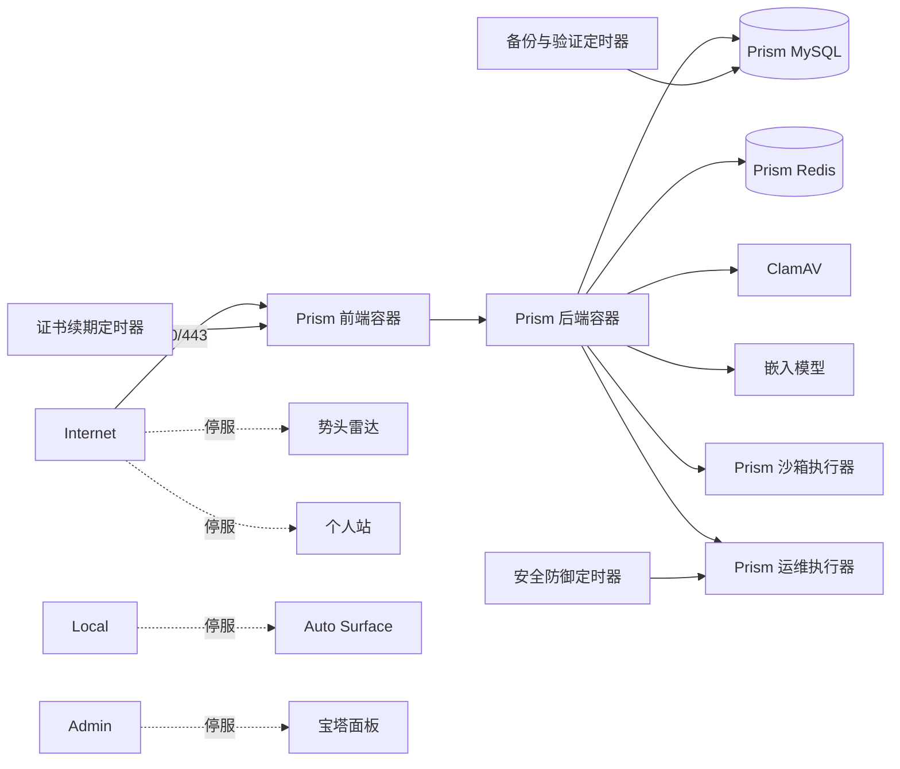

# 宿主机服务收敛设计

## 服务拓扑

## 执行原则

- 用 systemd 停止并禁用独立服务；宝塔通过 SysV `chkconfig` 关闭自启动后停止。
- 仅改变运行状态和自启动配置，保留应用文件、数据、数据库卷与云安全组。
- 发布使用标准备份、隔离恢复、迁移、镜像构建及健康门禁；生产审计修复复用同一请求编号，避免重复触发 root 动作。
- 停服后按目标监听端口、systemd 状态、容器健康、Prism HTTPS 与关键定时器逐项复核。
