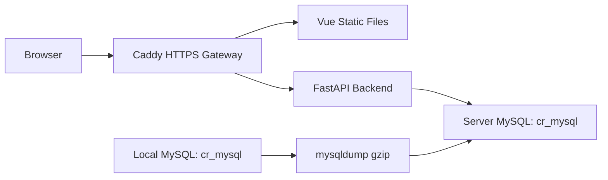
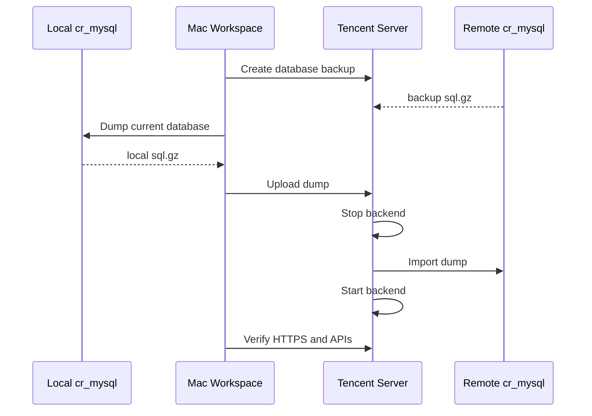

# 服务器错误修复与数据库迁移 - Design

## 架构图

```mermaid
flowchart LR
    User["Browser"] --> Caddy["Caddy HTTPS Gateway"]
    Caddy --> Frontend["Vue Static Files"]
    Caddy --> Backend["FastAPI Backend"]
    Backend --> RemoteDB["Server MySQL: cr_mysql"]
    LocalDB["Local MySQL: cr_mysql"] --> Dump["mysqldump gzip"]
    Dump --> RemoteDB
```

## 迁移流程

```mermaid
sequenceDiagram
    participant Local as Local cr_mysql
    participant Mac as Mac Workspace
    participant Server as Tencent Server
    participant RDB as Remote cr_mysql

    Mac->>Server: Create database backup
    RDB-->>Server: backup sql.gz
    Mac->>Local: Dump current database
    Local-->>Mac: local sql.gz
    Mac->>Server: Upload dump
    Server->>Server: Stop backend
    Server->>RDB: Import dump
    Server->>Server: Start backend
    Mac->>Server: Verify HTTPS and APIs
```

## 异常处理策略

- 导入前保留服务器备份文件和路径。
- 后端暂停期间避免导入过程写入不一致。
- 导入后如核心 API 仍异常，读取最新后端日志定位残余字段/代码问题。
- 如导入破坏线上可用性，用备份文件恢复并重新评估。
