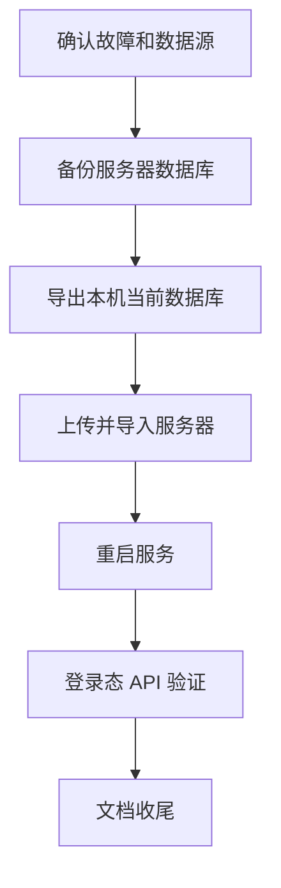

# 服务器错误修复与数据库迁移 - Task

## 任务依赖图

## 原子任务

| 任务 | 输入契约 | 输出契约 | 验收 |
| --- | --- | --- | --- |
| T1 故障定位 | 线上服务可访问，能读取日志 | 确认 500 根因 | 记录具体异常 |
| T2 服务器备份 | SSH 可用，MySQL 容器健康 | `/opt/code-review/backups/*.sql.gz` | 备份文件非空 |
| T3 本机导出 | 本机 `cr_mysql` 健康 | `/tmp/*.sql.gz` | dump 文件非空 |
| T4 线上导入 | dump 上传成功 | 线上库被本机数据替换 | 表结构和计数匹配 |
| T5 服务重启 | Compose 可用 | 后端重新连接新库 | 容器健康运行 |
| T6 API 验证 | 管理员可登录 | 核心 API 无 500 | 巡检通过 |
| T7 文档收尾 | 验证结果明确 | ACCEPTANCE/FINAL/TODO 更新 | 文档记录完成 |
