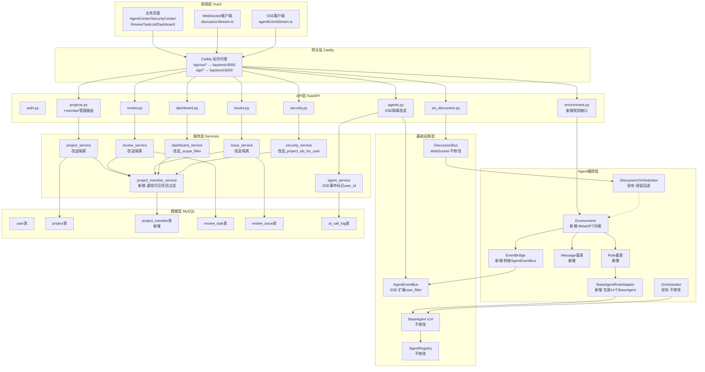
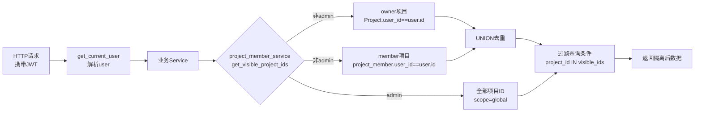
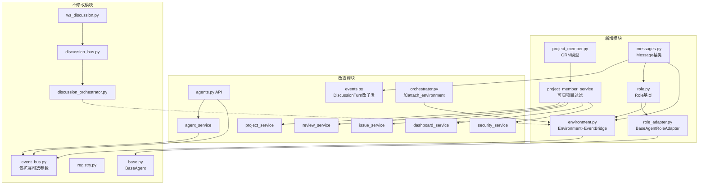
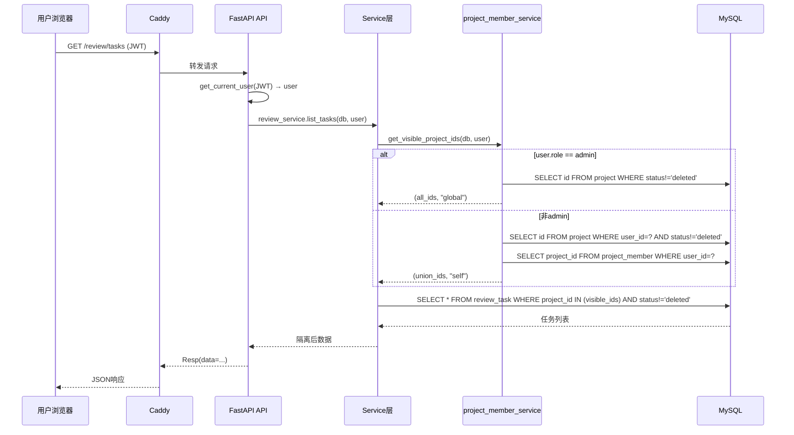
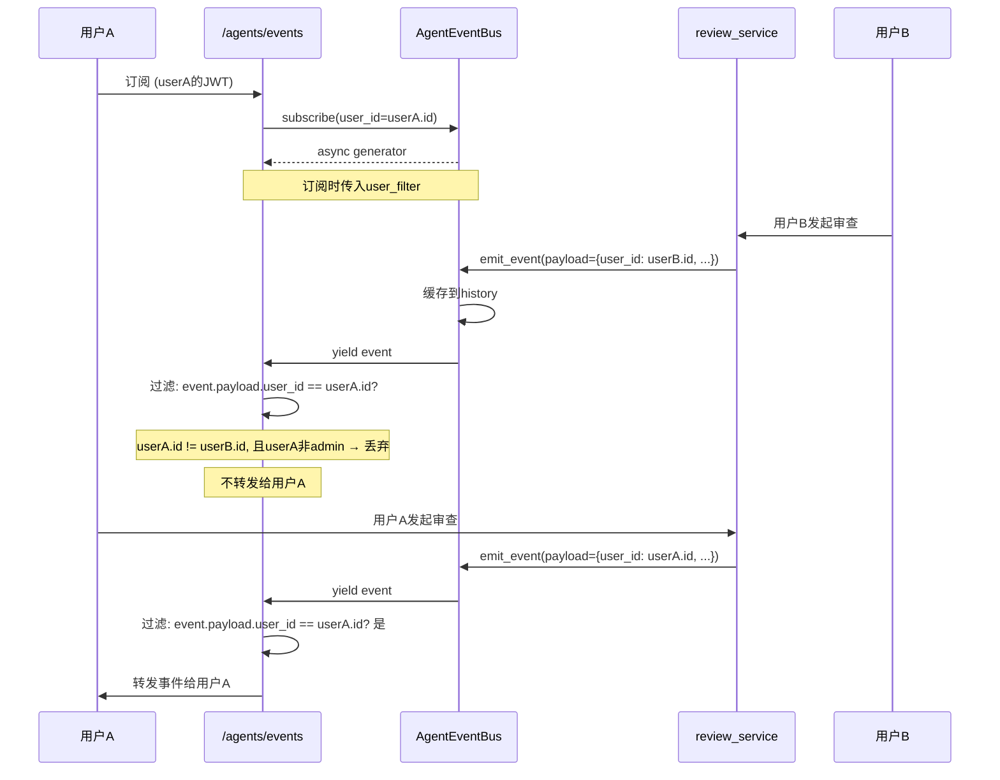
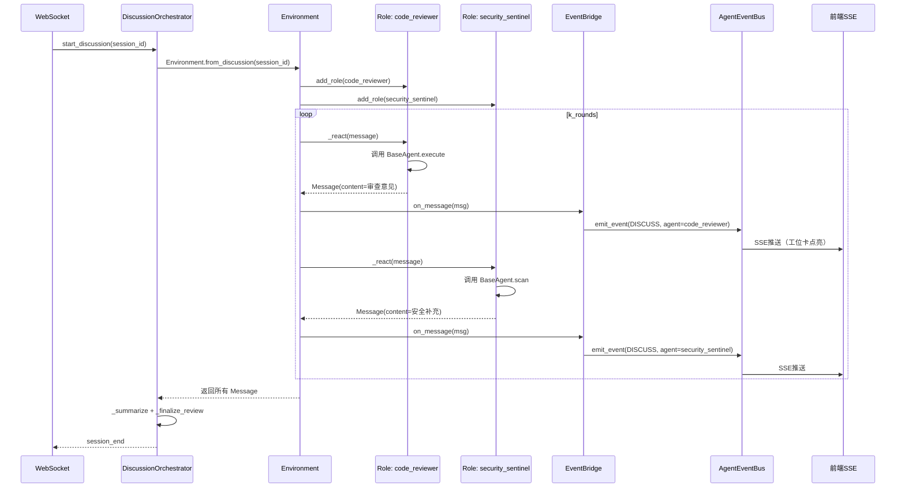

# DESIGN - 权限隔离与圆桌修复与MetaGPT编排

> 任务名：权限隔离与圆桌修复与MetaGPT编排
> 创建时间：2026-06-25
> 阶段：Architect（架构阶段）
> 前置：CONSENSUS_权限隔离与圆桌修复与MetaGPT编排.md

---

## 一、整体架构图

### 1.1 改造后整体架构



### 1.2 数据隔离过滤架构



---

## 二、分层设计和核心组件

### 2.1 数据层 - 新增 project_member 表

**表结构**：
| 字段 | 类型 | 说明 |
|------|------|------|
| id | BIGINT PK | 自增主键 |
| project_id | BIGINT | 项目ID，FK→project.id |
| user_id | BIGINT | 用户ID，FK→user.id |
| role_in_project | VARCHAR(20) | 角色：owner/reviewer |
| create_time | DATETIME | 创建时间 |

**索引**：
- `uk_project_user (project_id, user_id)` 唯一约束
- `ix_pm_user (user_id)` 按用户查可见项目
- `ix_pm_project (project_id)` 按项目查成员

**数据迁移**：现有项目的 owner 自动写入 project_member（role_in_project='owner'）

**ORM模型**：`backend/app/models/project_member.py`（新增）

### 2.2 服务层 - 通用可见项目过滤

**新增**：`backend/app/services/project_member_service.py`

核心函数：
```python
def get_visible_project_ids(db: Session, user: User) -> tuple[list[int], str]:
    """返回当前用户可见的项目 ID 列表 + 范围标识
    
    Args:
        db: 数据库会话
        user: 当前用户
    
    Returns:
        tuple[list[int], str]: (项目ID列表, scope)
            - admin: (全部项目ID, "global")
            - 非admin: (owner项目 ∪ member项目, "self")
    """

def is_project_member(db: Session, project_id: int, user: User) -> tuple[bool, str]:
    """判断用户是否为项目成员及角色
    
    Returns:
        tuple[bool, str]: (是否成员/owner/admin, role_in_project或"admin")
    """

def add_member(db: Session, project_id: int, user_id: int, role: str = "reviewer") -> ProjectMember:
    """加入成员（仅owner/admin可调用）"""

def remove_member(db: Session, project_id: int, user_id: int) -> bool:
    """移除成员（仅owner/admin可调用）"""

def list_members(db: Session, project_id: int) -> list[ProjectMember]:
    """列出项目成员"""
```

### 2.3 服务层改造点

#### project_service 改造
- `list_tasks`: `Project.user_id == user.id` → `Project.id.in_(visible_ids)`
- `get_project`: `project.user_id != user.id` → `project.id not in visible_ids`
- `update_project` / `delete_project`: 保持"仅 owner/admin"（用 `is_project_member` 判断 role=='owner'）

#### review_service 改造
- `list_tasks`: `ReviewTask.user_id == user.id` → `ReviewTask.project_id.in_(visible_ids)`
- `get_task_detail` / `list_task_issues`: `task.user_id != user.id` → `task.project_id not in visible_ids`
- `start`: `project.user_id != user.id` → `not is_project_member`
- `delete_task` / `cancel_task`: 保持"仅 owner/admin"

#### issue_service 改造
- `list_issues`: `ReviewTask.user_id == user.id` → `ReviewTask.project_id.in_(visible_ids)`
- `get_issue` / `update_status`: `task.user_id != user.id` → `task.project_id not in visible_ids`

#### dashboard_service 改造
- `_scope_filter`: 改为按 `visible_ids` 过滤（需传入 visible_ids 参数）
- `_valid_task_ids`: 改为 `ReviewTask.project_id.in_(visible_ids)`

#### security_service 改造
- `_project_ids_for_user`: 改为调用 `project_member_service.get_visible_project_ids`

#### agent_service 改造（SSE 隔离）
- `_emit_review_event`: 在 `AgentEvent.payload` 中填充 `user_id`
- `agents.py /agents/events`: 订阅时传入 `user_id`，yield 前过滤

### 2.4 API层 - project_member 管理路由

新增于 `backend/app/api/v1/projects.py`：
```
POST   /projects/{id}/members          加入成员（仅owner/admin）
DELETE /projects/{id}/members/{user_id} 移除成员（仅owner/admin）
GET    /projects/{id}/members          成员列表（owner/member/admin）
```

### 2.5 MetaGPT 编排层设计

#### 2.5.1 新增文件清单
| 文件 | 职责 |
|------|------|
| `backend/app/agents/messages.py` | Message 基类，DiscussionTurn 改为其子类 |
| `backend/app/agents/role.py` | Role 基类，提供 `_react(message) -> Message` |
| `backend/app/agents/role_adapter.py` | BaseAgentRoleAdapter 包装现有 BaseAgent |
| `backend/app/agents/environment.py` | Environment + EventBridge |

#### 2.5.2 Message 基类设计
```python
# backend/app/agents/messages.py
@dataclass
class Message:
    """MetaGPT 风格消息基类
    
    Attributes:
        sent_from: 发送者标识（agent name 或 'user'）
        send_to: 接收者标识（None 表示广播）
        cause_by: 触发动作名
        content: 消息内容
        timestamp: 发送时间
        extra: 扩展字段
    """
    sent_from: str
    send_to: Optional[str] = None
    cause_by: str = ""
    content: str = ""
    timestamp: datetime = field(default_factory=datetime.utcnow)
    extra: Dict[str, Any] = field(default_factory=dict)

# DiscussionTurn 改为 Message 子类（向后兼容）
# 在 events.py 中：class DiscussionTurn(Message): ...
```

#### 2.5.3 Role 基类设计
```python
# backend/app/agents/role.py
class Role:
    """MetaGPT 风格角色基类
    
    Role 是有状态的 Agent 封装，可接收 Message 并产出 Message。
    与 BaseAgent 的区别：BaseAgent 是无状态服务对象，Role 是有状态协作单元。
    """
    name: str
    description: str
    skills: list[str]
    
    def __init__(self, agent: Optional[BaseAgent] = None):
        self._agent = agent
        self._memory: list[Message] = []
    
    async def _react(self, message: Message) -> Optional[Message]:
        """对消息做出反应，返回新消息（或None表示不响应）"""
        raise NotImplementedError
    
    def observe(self, message: Message) -> None:
        """观察消息（存入记忆，不必然响应）"""
        self._memory.append(message)
    
    @property
    def memory(self) -> list[Message]:
        return self._memory
```

#### 2.5.4 BaseAgentRoleAdapter 设计
```python
# backend/app/agents/role_adapter.py
class BaseAgentRoleAdapter(Role):
    """把现有 BaseAgent 适配为 Role
    
    将 BaseAgent 的 execute/scan_xxx 方法转译为 _react 动作。
    不修改 BaseAgent 源码，零侵入。
    """
    
    def __init__(self, agent: BaseAgent, action_map: Dict[str, str]):
        """
        Args:
            agent: 被包装的 BaseAgent 实例
            action_map: 消息 cause_by → BaseAgent 方法名 映射
                例: {"review": "execute", "scan_file": "scan_file"}
        """
        super().__init__(agent)
        self._action_map = action_map
    
    async def _react(self, message: Message) -> Optional[Message]:
        method_name = self._action_map.get(message.cause_by)
        if not method_name:
            return None
        method = getattr(self._agent, method_name, None)
        if not method:
            return None
        # 调用 BaseAgent 方法，结果包装为 Message
        result = method(...)
        return Message(sent_from=self.name, content=str(result))
```

#### 2.5.5 Environment 设计
```python
# backend/app/agents/environment.py
class Environment:
    """MetaGPT 风格环境
    
    持有 MessageQueue 和 Roles，驱动多轮协作。
    位于 Orchestrator 之上，不修改现有类。
    """
    
    def __init__(self, roles: list[Role] = None):
        self._roles: Dict[str, Role] = {r.name: r for r in (roles or [])}
        self._messages: list[Message] = []
        self._bridge = EventBridge(self)
    
    def add_role(self, role: Role) -> None:
        """添加角色到环境"""
        self._roles[role.name] = role
    
    def publish(self, message: Message) -> None:
        """发布消息到环境"""
        self._messages.append(message)
        self._bridge.on_message(message)  # 桥接到 AgentEventBus
    
    async def run(self, k_rounds: int = 1) -> list[Message]:
        """运行 k 轮，每轮所有角色对消息做出反应"""
        produced = []
        for _ in range(k_rounds):
            for role in self._roles.values():
                for msg in list(self._messages):
                    role.observe(msg)
                    reaction = await role._react(msg)
                    if reaction:
                        self.publish(reaction)
                        produced.append(reaction)
        return produced
    
    @classmethod
    def from_discussion(cls, session_id: str) -> "Environment":
        """从圆桌讨论会话构建 Environment
        
        复用 DiscussionOrchestrator 的参会 Agent 配置，
        把 ReviewAgentProfile 包装为 Role。
        """
        # 工厂方法，后续实现

class EventBridge:
    """把 Environment 内的消息流桥接到 AgentEventBus
    
    前端 SSE 订阅 AgentEventBus，EventBridge 确保 Environment 内的
    Role 协作过程也能被前端 Agent 办公室观测到。
    """
    
    def __init__(self, env: Environment):
        self._env = env
    
    def on_message(self, message: Message) -> None:
        """消息到达时，转译为 AgentEvent 发布到 AgentEventBus"""
        from app.agents.event_bus import emit_event
        from app.agents.events import AgentEventType
        emit_event(
            type_=AgentEventType.DISCUSS,
            agent=message.sent_from,
            trace_id=message.extra.get("trace_id", ""),
            message=message.content[:200],
            payload={"environment": True, **message.extra},
        )
```

#### 2.5.6 接入点
- `orchestrator.py` 的 `get_request_orchestrator` 末尾增加可选 `attach_environment`：
```python
def get_request_orchestrator(db: Session, user: User) -> Orchestrator:
    orch = Orchestrator(register=False)
    orch.inject_db(db, user)
    # 新增：可选挂载 Environment（不影响现有调用）
    # orch.attach_environment(Environment())  # 默认不挂载，按需启用
    return orch
```
- `DiscussionOrchestrator.start_discussion` 内部可选走 `Environment.from_discussion()`，旧逻辑保留作回退

---

## 三、模块依赖关系图



---

## 四、接口契约定义

### 4.1 project_member 管理 API

#### POST /projects/{id}/members
```json
// Request
{
  "user_id": 123,
  "role_in_project": "reviewer"  // owner/reviewer
}
// Response 200
{
  "code": 0,
  "data": {
    "id": 1,
    "project_id": 456,
    "user_id": 123,
    "role_in_project": "reviewer",
    "create_time": "2026-06-25T10:00:00"
  }
}
// Response 403 (非owner/admin)
{"code": 40300, "message": "需要项目拥有者权限"}
// Response 404 (项目不存在)
{"code": 40400, "message": "项目不存在"}
```

#### DELETE /projects/{id}/members/{user_id}
```json
// Response 200
{"code": 0, "data": null}
// Response 403 (非owner/admin)
{"code": 40300, "message": "需要项目拥有者权限"}
```

#### GET /projects/{id}/members
```json
// Response 200
{
  "code": 0,
  "data": [
    {
      "id": 1,
      "user_id": 123,
      "username": "admin",
      "nickname": "管理员",
      "role_in_project": "owner",
      "create_time": "2026-06-25T10:00:00"
    }
  ]
}
```

### 4.2 SSE 事件流隔离改造

#### GET /agents/events（改造后）
- 请求不变（携带 Authorization header）
- 响应流：仅返回当前用户可见的事件
  - admin: 返回所有事件
  - 非admin: 仅返回 `event.payload.user_id == user.id` 的事件 + 全局系统事件（无 user_id 的）

### 4.3 Environment 观测 API（新增·可选）

#### GET /agents/environment
```json
{
  "code": 0,
  "data": {
    "active_environments": 0,
    "total_roles": 14,
    "message_count": 0
  }
}
```

---

## 五、数据流向图

### 5.1 数据隔离请求流



### 5.2 SSE 事件隔离流



### 5.3 MetaGPT Environment 协作流



---

## 六、异常处理策略

### 6.1 数据隔离异常
| 异常场景 | 处理策略 | HTTP状态码 |
|---------|---------|-----------|
| 非成员访问项目 | NotFoundError("项目不存在") | 404 |
| 非owner/admin修改项目 | ForbiddenError("需要项目拥有者权限") | 403 |
| 非owner/admin管理成员 | ForbiddenError("需要项目拥有者权限") | 403 |
| 加入成员时用户不存在 | NotFoundError("用户不存在") | 404 |
| 重复加入成员 | IntegrityError 捕获 → BadRequestError("已是项目成员") | 400 |

### 6.2 WebSocket 异常
| 异常场景 | 处理策略 |
|---------|---------|
| Caddy 代理超时 | 检查 backend 容器健康，重启 |
| 证书过期 | Caddy 自动续期失败 → 手动续期 |
| 后端 WS 端点 500 | 查看后端日志，修复代码 |
| 子协议鉴权失败 | 前端 token 过期 → 重新登录 |

### 6.3 MetaGPT 编排层异常
| 异常场景 | 处理策略 |
|---------|---------|
| Role._react 抛异常 | 捕获，发布 FAILED 事件，继续下一 Role |
| Environment.from_discussion 失败 | 回退到 DiscussionOrchestrator 旧逻辑 |
| EventBridge 桥接失败 | 记录日志，不影响 Environment 内部流程 |

### 6.4 部署同步异常
| 异常场景 | 处理策略 |
|---------|---------|
| git pull 冲突 | 手动解决冲突，保留服务器端 .env 配置 |
| docker build 失败 | 查看构建日志，修复 Dockerfile/依赖 |
| Alembic 迁移失败 | 回滚到上一版本，检查迁移脚本 |
| 容器启动失败 | `docker logs <container>` 查看错误，修复配置 |

---

## 七、设计可行性验证

### 7.1 与现有系统无冲突验证
- ✅ project_member 表为新增表，不影响现有表
- ✅ project_member_service 为新增 service，改造现有 service 仅修改过滤条件
- ✅ MetaGPT 编排层为新增文件，不修改现有 BaseAgent/Orchestrator/Registry
- ✅ SSE 隔离仅扩展 AgentEventBus.subscribe 可选参数，不破坏现有签名
- ✅ DiscussionOrchestrator 保留，Environment.from_discussion 为可选工厂

### 7.2 复杂度评估
| 模块 | 复杂度 | 风险 |
|------|--------|------|
| project_member 表 + ORM | 低 | 新增表，无风险 |
| project_member_service | 低 | 新增 service，纯查询 |
| 6个 service 隔离改造 | 中 | 需仔细测试过滤条件 |
| SSE 隔离 | 中 | 需确保 admin 不受影响 |
| MetaGPT 编排层 | 中高 | 新抽象层，需验证与现有 DiscussionOrchestrator 的兼容 |
| WebSocket 修复 | 低-中 | 取决于根因 |
| 双端同步 | 低 | git+docker 标准流程 |

### 7.3 设计原则遵循
- ✅ 严格按照任务范围，避免过度设计
- ✅ 与现有系统架构一致（FastAPI+SQLAlchemy+Pydantic 模式）
- ✅ 复用现有组件（_scope_filter 模式、emit_event 机制）
- ✅ 不破坏现有契约（BaseAgent/Registry/EventBus/DiscussionOrchestrator）

---

## 八、下一步

进入 Atomize 阶段，生成 TASK 原子任务文档，拆分实施任务并明确依赖关系。
