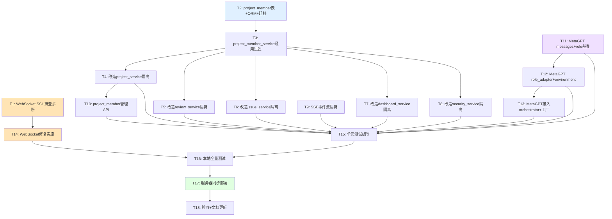

# TASK - 权限隔离与圆桌修复与MetaGPT编排

> 任务名：权限隔离与圆桌修复与MetaGPT编排
> 创建时间：2026-06-25
> 阶段：Atomize（原子化阶段）
> 前置：DESIGN_权限隔离与圆桌修复与MetaGPT编排.md

---

## 一、任务依赖图

**并行机会**：
- T1（WebSocket排查）与 T2-T13（数据隔离+MetaGPT）可并行
- T4/T5/T6/T7/T8（5个service改造）在 T3 完成后可并行
- T11/T12/T13（MetaGPT）与 T4-T10（数据隔离）可并行

---

## 二、原子任务清单

### T1: WebSocket SSH 排查诊断
| 项 | 内容 |
|---|---|
| **描述** | SSH 登录 81.70.251.90，排查圆桌讨论 WebSocket 连接失败根因 |
| **输入契约** | 服务器 IP 81.70.251.90，SSH 22 端口，root 账号，密码 Lijd20041107 |
| **输出契约** | 诊断报告：根因 + 修复方案 + 受影响文件清单 |
| **实现约束** | 仅诊断，不修改代码；记录所有排查命令和输出 |
| **依赖** | 无（独立任务） |
| **验收** | 明确根因（Caddy/证书/容器/代码/配置） |

### T2: project_member 表 + ORM 模型 + Alembic 迁移
| 项 | 内容 |
|---|---|
| **描述** | 新增 project_member 表的 ORM 模型和 Alembic 迁移脚本 |
| **输入契约** | DESIGN 文档 2.1 节表结构定义 |
| **输出契约** | `backend/app/models/project_member.py` + `backend/alembic/versions/003_project_member.py` |
| **实现约束** | 遵循现有 ORM 模式（IdMixin+TimestampMixin）；迁移含数据回填（现有项目 owner 写入） |
| **依赖** | 无 |
| **验收** | `alembic upgrade head` 成功，表结构正确，owner 数据回填 |

### T3: project_member_service 通用过滤函数
| 项 | 内容 |
|---|---|
| **描述** | 新增 project_member_service，提供 get_visible_project_ids 等通用函数 |
| **输入契约** | T2 完成的 project_member ORM 模型 |
| **输出契约** | `backend/app/services/project_member_service.py` |
| **实现约束** | 函数级注释完整；复用现有 _project_ids_for_user 模式 |
| **依赖** | T2 |
| **验收** | get_visible_project_ids 对 admin 返回全局，对非 admin 返回 owner∪member |

### T4: 改造 project_service 数据隔离
| 项 | 内容 |
|---|---|
| **描述** | 改造 project_service 的 list/get/update/delete，按 project_member 过滤 |
| **输入契约** | T3 完成的 project_member_service |
| **输出契约** | 修改 `backend/app/services/project_service.py` |
| **实现约束** | 读权限扩展为 owner∪member∪admin；写权限保持 owner∪admin |
| **依赖** | T3 |
| **验收** | 成员可见项目，非成员不可见，写权限不变 |

### T5: 改造 review_service 数据隔离
| 项 | 内容 |
|---|---|
| **描述** | 改造 review_service 的 list_tasks/get_task_detail/list_task_issues/start/delete/cancel |
| **输入契约** | T3 完成的 project_member_service |
| **输出契约** | 修改 `backend/app/services/review_service.py` |
| **实现约束** | list_tasks 按 visible_project_ids 过滤；start 允许 member 发起；delete/cancel 保持 owner∪admin |
| **依赖** | T3 |
| **验收** | 成员可见同项目任务，可发起审查，不可删除他人任务 |

### T6: 改造 issue_service 数据隔离
| 项 | 内容 |
|---|---|
| **描述** | 改造 issue_service 的 list_issues/get_issue/update_status |
| **输入契约** | T3 完成的 project_member_service |
| **输出契约** | 修改 `backend/app/services/issue_service.py` |
| **实现约束** | 按 visible_project_ids 过滤；update_status 保持 owner∪admin |
| **依赖** | T3 |
| **验收** | 成员可见同项目问题，不可修改他人项目问题状态 |

### T7: 改造 dashboard_service 数据隔离
| 项 | 内容 |
|---|---|
| **描述** | 改造 dashboard_service 的 _scope_filter 和 _valid_task_ids |
| **输入契约** | T3 完成的 project_member_service |
| **输出契约** | 修改 `backend/app/services/dashboard_service.py` |
| **实现约束** | _scope_filter 改为按 visible_project_ids 过滤 |
| **依赖** | T3 |
| **验收** | 仪表盘统计按可见项目过滤 |

### T8: 改造 security_service 数据隔离
| 项 | 内容 |
|---|---|
| **描述** | 改造 security_service 的 _project_ids_for_user |
| **输入契约** | T3 完成的 project_member_service |
| **输出契约** | 修改 `backend/app/services/security_service.py` |
| **实现约束** | _project_ids_for_user 改为调用 project_member_service.get_visible_project_ids |
| **依赖** | T3 |
| **验收** | 安全态势按可见项目过滤 |

### T9: SSE 事件流隔离改造
| 项 | 内容 |
|---|---|
| **描述** | 改造 AgentEventBus 和 /agents/events SSE 端点，按 user_id 过滤事件 |
| **输入契约** | 现有 AgentEventBus（event_bus.py）和 agents.py |
| **输出契约** | 修改 `backend/app/agents/event_bus.py` + `backend/app/api/v1/agents.py` + `backend/app/services/review_service.py`(_emit_review_event) |
| **实现约束** | AgentEventBus.subscribe 增加可选 user_filter 参数；事件 payload 标记 user_id；admin 不过滤 |
| **依赖** | 无（独立于 T3） |
| **验收** | 用户A订阅SSE不收到用户B的事件；admin 收到所有事件 |

### T10: project_member 管理 API
| 项 | 内容 |
|---|---|
| **描述** | 新增 project_member 管理路由（加入/移除/列表成员） |
| **输入契约** | T3 完成的 project_member_service + T4 完成的 project_service 改造 |
| **输出契约** | 修改 `backend/app/api/v1/projects.py` + 新增 `backend/app/schemas/project_member.py` |
| **实现约束** | 加入/移除仅 owner∪admin 可调用；列表 owner∪member∪admin 可查 |
| **依赖** | T3, T4 |
| **验收** | API 契约符合 DESIGN 4.1 节 |

### T11: MetaGPT messages.py + role.py 基类
| 项 | 内容 |
|---|---|
| **描述** | 新增 Message 基类和 Role 基类，DiscussionTurn 改为 Message 子类 |
| **输入契约** | DESIGN 2.5.2/2.5.3 节设计 |
| **输出契约** | 新增 `backend/app/agents/messages.py` + `backend/app/agents/role.py` + 修改 `backend/app/agents/events.py` |
| **实现约束** | DiscussionTurn 继承 Message 向后兼容；Role 提供 _react/observe 接口 |
| **依赖** | 无（独立于数据隔离） |
| **验收** | import 无误；DiscussionTurn 仍可正常使用 |

### T12: MetaGPT role_adapter.py + environment.py
| 项 | 内容 |
|---|---|
| **描述** | 新增 BaseAgentRoleAdapter 和 Environment + EventBridge |
| **输入契约** | T11 完成的 Message/Role 基类 |
| **输出契约** | 新增 `backend/app/agents/role_adapter.py` + `backend/app/agents/environment.py` |
| **实现约束** | BaseAgentRoleAdapter 包装现有 BaseAgent 零修改；Environment 持有 MessageQueue |
| **依赖** | T11 |
| **验收** | 可创建 Environment 实例，add_role/publish/run 方法可用 |

### T13: MetaGPT 接入 orchestrator + 工厂方法
| 项 | 内容 |
|---|---|
| **描述** | 在 orchestrator 增加 attach_environment，实现 Environment.from_discussion 工厂 |
| **输入契约** | T12 完成的 Environment |
| **输出契约** | 修改 `backend/app/agents/orchestrator.py` + `backend/app/agents/environment.py`(工厂方法) |
| **实现约束** | attach_environment 可选，默认不挂载；from_discussion 复用 DiscussionOrchestrator 配置 |
| **依赖** | T12 |
| **验收** | get_request_orchestrator 不受影响；Environment.from_discussion 可创建实例 |

### T14: WebSocket 修复实施
| 项 | 内容 |
|---|---|
| **描述** | 根据 T1 诊断结果，实施 WebSocket 修复 |
| **输入契约** | T1 诊断报告 |
| **输出契约** | 修复代码/配置，服务器重新部署 |
| **实现约束** | 不改变前端子协议鉴权；不改变后端控制协议 |
| **依赖** | T1 |
| **验收** | 101 Switching Protocols；前端不再"连接失败" |

### T15: 单元测试编写
| 项 | 内容 |
|---|---|
| **描述** | 为 project_member、数据隔离、SSE 隔离、MetaGPT 编排层编写单元测试 |
| **输入契约** | T2-T13 完成的代码 |
| **输出契约** | 新增测试文件于 `backend/tests/unit/` |
| **实现约束** | 覆盖正常流程、边界条件、异常情况；测试优先原则 |
| **依赖** | T4,T5,T6,T7,T8,T9,T10,T11,T12,T13 |
| **验收** | 新增测试全部通过；现有测试不回归 |

### T16: 本地全量测试
| 项 | 内容 |
|---|---|
| **描述** | 本地运行全量测试，确保无回归 |
| **输入契约** | T14,T15 完成 |
| **输出契约** | 测试报告 |
| **实现约束** | `pytest backend/tests/` 全部通过 |
| **依赖** | T14, T15 |
| **验收** | 所有测试通过，无回归 |

### T17: 服务器同步部署
| 项 | 内容 |
|---|---|
| **描述** | 本地 git commit → SSH 服务器 git pull → docker compose up -d --build |
| **输入契约** | T16 通过 |
| **输出契约** | 服务器部署成功，所有服务 healthy |
| **实现约束** | 保留回滚能力；数据库迁移自动执行 |
| **依赖** | T16 |
| **验收** | docker compose ps 全 Running；healthz 200；alembic head |

### T18: 验收 + 文档更新
| 项 | 内容 |
|---|---|
| **描述** | 整体验收，更新 ACCEPTANCE/FINAL/TODO 文档，更新说明文档.md |
| **输入契约** | T17 完成 |
| **输出契约** | ACCEPTANCE + FINAL + TODO 文档 |
| **实现约束** | 按 CONSENSUS 验收标准逐项验证 |
| **依赖** | T17 |
| **验收** | 所有验收标准满足 |

---

## 三、任务执行顺序

### 阶段一：并行启动（WebSocket排查 + 数据隔离基础）
1. **T1** WebSocket SSH 排查诊断（独立）
2. **T2** project_member 表 + ORM + 迁移（独立）

### 阶段二：数据隔离核心（T2完成后）
3. **T3** project_member_service 通用过滤（依赖T2）
4. **T11** MetaGPT messages + role 基类（独立，可与T3并行）

### 阶段三：service 改造并行（T3完成后）
5. **T4** 改造 project_service（依赖T3）
6. **T5** 改造 review_service（依赖T3）
7. **T6** 改造 issue_service（依赖T3）
8. **T7** 改造 dashboard_service（依赖T3）
9. **T8** 改造 security_service（依赖T3）
10. **T9** SSE 事件流隔离（独立，可与T4-T8并行）
11. **T12** MetaGPT role_adapter + environment（依赖T11，可与T4-T9并行）

### 阶段四：API + 接入（T4/T12完成后）
12. **T10** project_member 管理 API（依赖T3,T4）
13. **T13** MetaGPT 接入 orchestrator（依赖T12）
14. **T14** WebSocket 修复实施（依赖T1）

### 阶段五：测试 + 部署
15. **T15** 单元测试编写（依赖T4-T10,T11-T13）
16. **T16** 本地全量测试（依赖T14,T15）
17. **T17** 服务器同步部署（依赖T16）
18. **T18** 验收 + 文档更新（依赖T17）

---

## 四、质量检查清单

- [ ] 完整性：任务覆盖所有需求（WebSocket+隔离+审查员+MetaGPT+同步）
- [ ] 一致性：与 ALIGNMENT/CONSENSUS/DESIGN 文档保持一致
- [ ] 可行性：技术方案确实可行，复用现有模式
- [ ] 可控性：每个任务复杂度可控，依赖关系无循环
- [ ] 可测性：每个任务有明确验收标准
