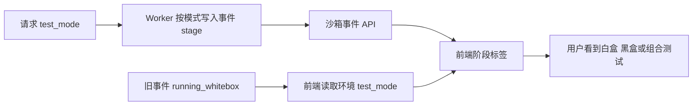

# 沙箱测试阶段标识设计

```mermaid
flowchart LR
  A[请求 test_mode] --> B[Worker 按模式写入事件 stage]
  B --> C[沙箱事件 API]
  C --> D[前端阶段标签]
  D --> E[用户看到白盒 黑盒或组合测试]
  F[旧事件 running_whitebox] --> G[前端读取环境 test_mode]
  G --> D
```

后端继续用现有活动 `status` 管理任务生命周期；只有事件 `stage` 按白盒、黑盒、组合区分。前端 `stageLabel` 接收可选测试模式：新阶段按名称直接翻译，旧阶段仅在其历史模式字段表明黑盒或组合时覆写标签，其余情况保持现有映射。未知阶段继续原样显示，保证向前兼容。
