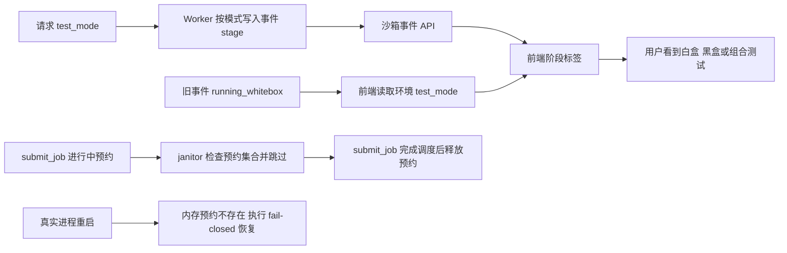

# 沙箱测试阶段标识设计

后端继续用现有活动 `status` 管理任务生命周期；只有事件 `stage` 按白盒、黑盒、组合区分。前端 `stageLabel` 接收可选测试模式：新阶段按名称直接翻译，旧阶段仅在其历史模式字段表明黑盒或组合时覆写标签，其余情况保持现有映射。未知阶段继续原样显示，保证向前兼容。

`submit_job()` 在写入 validating 状态后，把 request_id 放入进程内 `SUBMISSIONS_INFLIGHT`，直到容器启动、监控线程接管或提交错误收尾。周期 janitor 扫描落盘状态时，在进入过期/清理/重启恢复分支前检查该集合；命中时跳过本轮，避免将同一 Worker 进程正在执行的准备阶段误判为上次进程遗留。进程崩溃/重启后集合天然为空，恢复分支仍按既有失败关闭规则处理不可恢复阶段。
