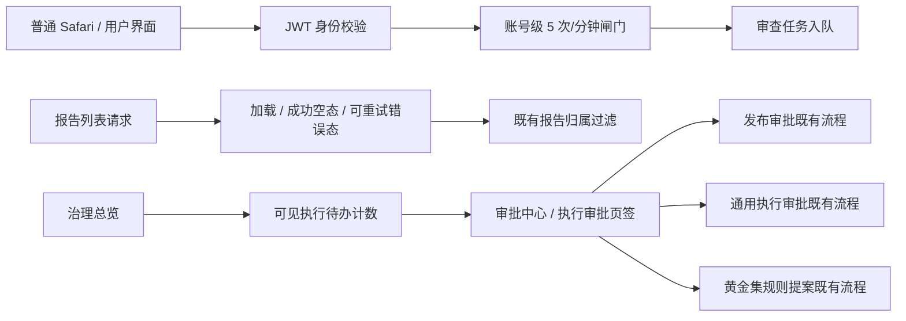

# 设计：渗透报告修复复测

## 处理架构

## 模块方案

- 限流器用已签名 JWT 的 `sub` 作为 Redis 账号键；不存原始 token，不按会话版本分桶。无效/缺失令牌回退可信代理解析的客户端 IP；认证依赖仍负责拒绝无效令牌。
- 报告页用请求代次避免过期请求覆盖当前结果；加载失败清空不可信旧结果、显示本地化错误和重试按钮。
- 审批计数通过审批服务的同一可见性判定器统计 `pending` 项，并排除只在专用发布页处理的动作；上限提升至 1000，避免默认仅展示 100 项。
- 生产验收分层：发布前全量自动化，发布时运维只读/备份门禁，发布后健康接口与浏览器页面；不对旧生产样本执行删除。

## 故障策略

- 超额审查在调用业务 service 前返回 429 并带 `Retry-After`。
- 报告列表网络失败呈现重试态，不呈现“暂无报告”。
- 生产不可用或发布门禁失败时停止发布并保留原版本；数据库恢复不作为自动回滚动作。
