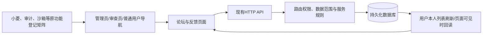
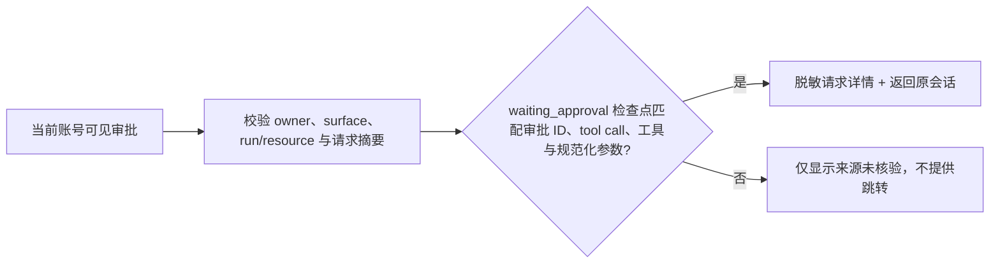
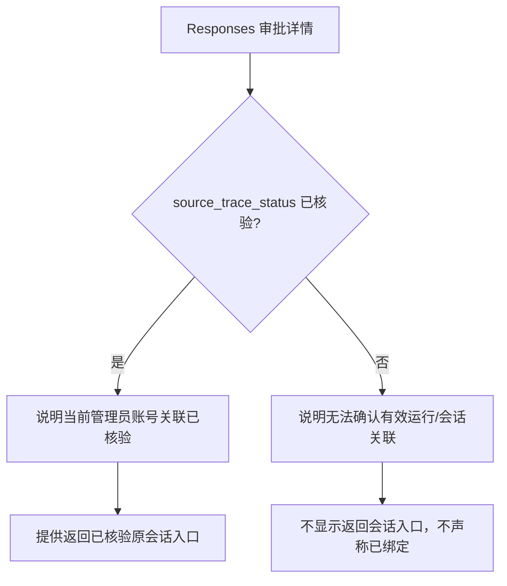

# 三角色闭环设计

当前项目没有通用站内通知服务；反馈不假称实时推送。反馈回复写入现有记录并通过提交者下次查看/页面可见时刷新呈现。高风险审批和管理接口权限不随菜单修复而改变。

职责：主代理核生产版本、真实点击、公共布局及整合；论坛代理核帖子/编辑入口/失败恢复/键盘和响应式；反馈代理核权限、状态、回复审计及刷新；独立代理比对版本登记与权限规划。

已复现范围：管理导航缺少论坛/反馈；管理员无他人帖子编辑入口；详情迟到响应覆盖草稿；列表过期请求覆盖新查询、读取失败误显示空列表；帖子行不可键盘聚焦；反馈空回复可标记已回复，回复对话框默认重置状态，已读接口无前端操作。

修复沿用项目布局、路由权限和API边界；明确加载、空态、失败重试、已读、回复状态、修改保留和刷新反馈。不扩大普通用户数据范围，不把测试文案留在生产。

## 后续补充：审批请求追溯

审批列表请求参数必须经现有统一脱敏逻辑处理；Responses 会话链接仅当审批记录 owner、管理端 surface、run/resource 与关联请求摘要一致，且运行检查点仍处于 waiting_approval 并精确匹配本条审批 ID、tool call ID、工具名和同一持久化规范化器处理后的参数时提供。检查点与审批的参数比较使用规范化 JSON，保留布尔值、整数和浮点数的类型差异。验证失败时只返回“来源未核验”，不推测来源、不泄漏 session ID；坏 JSON、非对象 JSON 与缺少字段均按未核验处理。

关联查询按审批页批量执行，避免逐条查询；活动会话目录最多读取 API 上限 100 条。等待审批的会话不可归档，返回路径仍限定在当前管理员账号和 admin surface。

### v4.0.74 审批来源状态文案

列表仅对已核验请求显示需在原会话处理；未核验请求依靠来源列与详情警示说明现状。此修复只改变展示，不改变审批 API、数据状态或权限。

### v4.0.75 首次异步值

`useCountUp` 首次观察到 source 更新时立即把 display 设为该值；后续有限数值变化沿用原 cubic-out 与 reduced-motion 逻辑。组件调用者、API 和业务口径不变。
