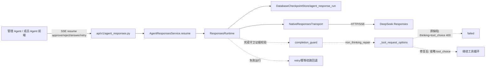

# DESIGN：生产 Agent 审批失败回退与 tool_choice 修复

## 1. 架构图（相关链路）

## 2. 状态机变更

- 可恢复终态：`failed`、`incomplete`、`max_rounds_exceeded`。
- `retry`：可恢复终态 → 有 pending 回 `waiting_approval/waiting_input`；无 pending → `running` 并 `_drive`。
- `approve/reject/answer`：遇到可恢复终态且调用已有证据 → 幂等续跑（不改写已审批记录）。

## 3. 接口契约

- `POST /api/agent-responses/stream` body.action 增加 `"retry"`（与 start/approve/reject/answer 并列）。
- `retry` 请求：`{action:"retry", surface, session_id, run_id}`。
- 返回：与 start 相同的 SSE 事件流（response.created → … → response.completed/failed/…）。

## 4. 异常处理

- 非可恢复终态（running/waiting/completed/cancelled）调用 retry → `InvalidRunStateError`，SSE 返回 error 事件。
- 可恢复终态但 pending 存在 → 回到等待决策，不自动重放写操作。
- 工具执行账本 `agent_tool_execution` 仍以 request_id 幂等，续跑不会重复写。
