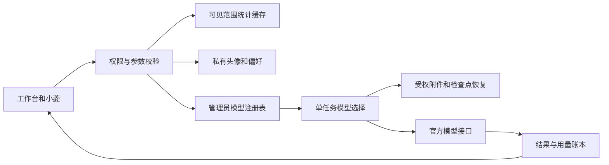

# 生产体验与多模态设计

```mermaid
flowchart LR
 UI[工作台和小菱] --> API[权限与参数校验]
 API --> Stats[可见范围统计缓存]
 API --> Profile[私有头像和偏好]
 API --> Registry[管理员模型注册表]
 Registry --> Run[单任务模型选择]
 Run --> Assets[受权附件和检查点恢复]
 Run --> Provider[官方模型接口]
 Provider --> Ledger[结果与用量账本]
 Ledger --> UI
```

沿用现有接口与数据模型，能力在服务端校验。图片模型只在run作用域覆盖；附件按用户和会话读取。恢复失败显式反馈，不静默丢图/降到文本模型。非关键面板独立错误重试，鉴权与数据完整性失败关闭。
