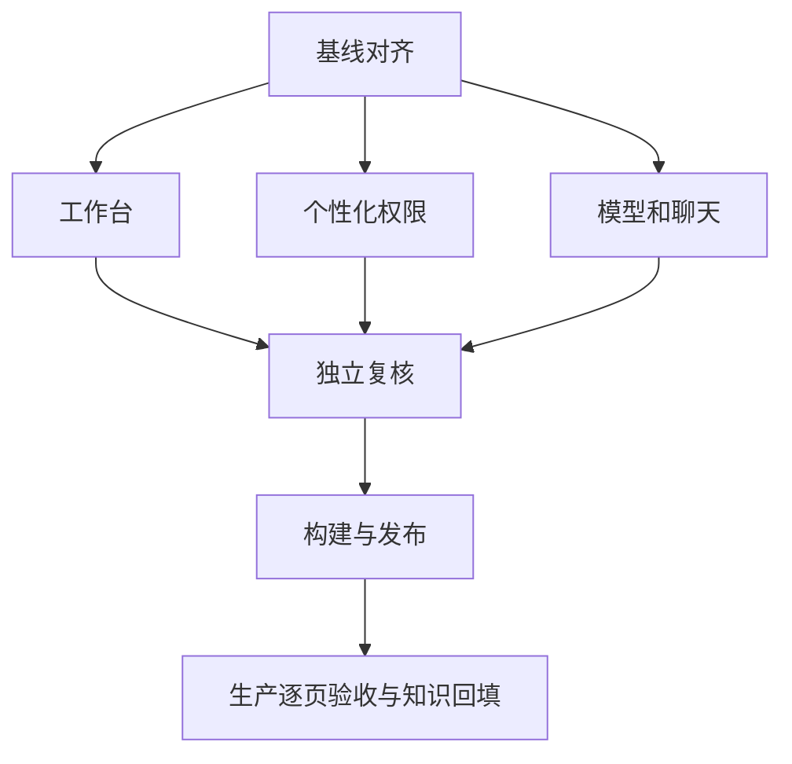

# 生产体验与多模态任务

|任务|输入|输出与验证|负责人|状态|
|---|---|---|---|---|
|生产基线和旧声明核验|服务器/知识库|源码镜像迁移证据|主代理|发布前核验完成，待发布后复验|
|工作台图表进度评分|当前页面/API|红测、修复与尺寸/错误验证|工作台代理|实现与独审通过，待生产复验|
|头像偏好工坊权限|用户服务和组件|图片/偏好/角色闭环测试|个性化代理|实现与独审通过，待生产复验|
|模型注册与恢复|官方文档和run代码|能力校验和执行恢复回归|模型代理|实现与独审通过，待生产实调|
|聊天图片交互与全页UI|两个聊天组件/浏览器|附件失败反馈及截图|主代理|发布前核验完成，待发布后复验|
|独立复核发布回填|各模块验收|测试、bundle、备份、线上验证、主库记录|主代理与独立代理|独审完成，最终门禁和发布进行中|

