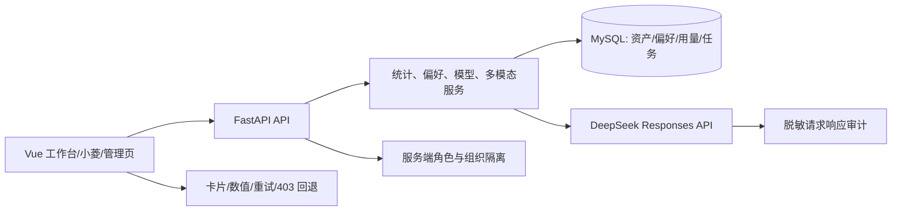

# 生产体验与多模态 2026-09-16 设计

## 核心实现

- `dashboard_service` 对有效评分做 `NULL` 与 0-100 边界过滤；前端图表有 ResizeObserver、错误态和数值列表。
- `AgentResponsesService` 在纯文本路径剥离兼容字段 `images=[]`；视觉路径解析资产引用并在重试时按用户/会话恢复。
- `DeepSeekResponsesRuntime` 将本轮请求快照附在记账回调；服务层对 data URL 做 SHA-256 摘要替换后写入 `AiCallLog`。
- `system_config_service` 保存模型注册表和 `chat/chat_vision/orchestrator/subagent/agent:*` 分配；视觉会话结束后不覆盖文本默认配置。
- 路由元数据和后端权限同时限制 Agent 工坊；失败请求进入标准错误页或局部重试路径。

## 回滚策略

部署脚本发布前执行 MySQL 一致性备份；迁移/健康/HTTPS 冒烟失败时切回上一应用镜像并保留 pending 状态。数据库不自动 downgrade，需独立核验备份和 Alembic revision。
