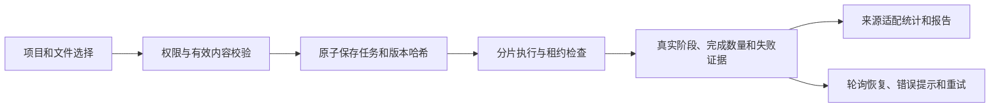

# 生产修复与交互闭环：设计

## 核心约束

复用现有 ReviewTask、ReviewTaskFile、CodeVersion 和事件总线。新增兼容性可空快照字段及任务覆盖信息；仅新任务要求完整快照，历史记录标识未知，不伪造回填。后台恢复必须校验版本与哈希。

必需分析失败通过明确异常向上传播，保留部分证据但不生成成功评分。任务写入前使用当前锁定状态和执行租约；外部模型调用期间不持有任务行锁。生产 MySQL 重复读隔离不能仅用身份映射刷新证明已看到新状态。

隔离使用现有 Project.status 的内部 `quarantined` 状态，普通业务不可列出、访问、恢复；原状态保留在受限运维清单中。既有 archived 状态保持不变。

界面不增加伪随机图表或倒计时。能够计算的显示真实数量，未知阶段显示不确定进度；忙态禁止重复，失败明确原因，重试保留输入，支持减少动态效果。

## 总览与发布续接约束

总览的安全态势、来源地图、Agent 和服务器指标各自维护加载、失败、空数据与成功状态。安全徽章只描述应用日志可证明的态势；接口失败或字段缺失不推断健康。服务器可见性遵循启用的 `admin` 用户、旧角色与有效 RBAC 绑定共同成立的既有契约，不放宽后端权限。

发布链必须同时绑定提交、镜像与语义版本。历史账本缺少版本时，只接受对应提交或原镜像的可验证证据，不用当前根目录版本猜测旧版。数据库恢复使用的迁移镜像必须在停服及重建库之前可用；应用回滚不自动降级 047 或恢复生产数据库。047 的降级会删除新增快照与覆盖字段，不能称为无损回滚。
