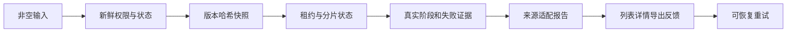

# 生产修复与交互闭环：最终报告

## 实际发布续接

UTC 2026-09-05 19:36:21 已完成生产发布：3.8.4 / `343616d9d40c1e44e17c7da465c7173c418debb5`，047 迁移、备份恢复、镜像/默认环境一致性及公网检查通过。四个已逐项核实来源的 E2E 项目随后通过新的备份恢复门禁进行可逆隔离。详见 `../小菱与全栈优化20260906/生产发布验收.md` 和该任务的独立后验报告。

下方原验证结论保留提交前时点，不能据此再次判定“没有 Git”“仍待提交/部署”。生产部署完成与全角色、真实模型的业务签收分开，后者仍需真实登录会话。

## 授权续接（2026-09-06，UTC+08:00）

用户明确回复“确认，但是我记得是有git的”，本地提交授权已解决。项目始终存在 Git 仓库，此前缺少的是包含本轮修复的稳定提交，而不是缺少 Git。继续在既有分支提交并以精确 SHA 发布，不创建新分支、不向远端推送。下文保留提交前验证快照，实际生产结果另记，不把授权等同于发布完成。

新增小菱、SOP、多 Agent 和动效优化与本轮已验收修复分开；参考动效库先独立预览，等待用户选择后接入，未经验证的新架构不混入本次生产发布。

## 提交前验证快照

前轮扫描输入、真实结果、快照一致性、权限隔离、任务状态、报告来源、前端反馈和调度兼容性已具备代码修复与回归证据。2026-09-06（UTC+08:00）续验补充修复了总览误报及发布链风险：后端 2782 项、前端 575 项、发布链新增 19 项全部通过，类型检查、前端 lint、运行代码 Ruff、编译构建和契约检查通过，独立计数复算一致。

这不是生产签收。生产发布仍需满足版本、提交、迁移、认证浏览器和真实业务验收门禁，当前不能把本地修复描述成已上线。

公网最新留存证据为 UTC 2026-09-05 18:19:25（本地 2026-09-06 02:19:25）：healthz/readyz 为 200，仍运行 3.8.3 / 4b1711adf0e79a95eed35be3ab17605fe10869cf。本地 3.8.4 只是待提交工作树，未生成可投产 SHA，未执行部署、047 升级或测试项目隔离 apply。

## 真实数据口径

- 生产只读审计保留在 `../生产只读全量核验20260905/`，本次没有覆盖或篡改旧报告。
- 仪表盘、报告和问题统计按用户可见项目及真实任务来源计算；没有新增随机数、静态演示图表或成功兜底。
- 历史未知值保持未知：没有把缺失快照、缺失 AI 用量或不可定位登录来源编造成具体事实。
- 本地 HTTP 验收使用隔离 SQLite 和显式标记环境，仅证明契约闭环，不证明生产数据内容。

## 技术闭环

重点实现文件包括：

- `backend/app/services/review_input_service.py`
- `backend/app/services/review_service.py`
- `backend/app/services/project_member_service.py`
- `backend/app/services/project_service.py`
- `backend/app/services/report_service.py`
- `backend/alembic/versions/047_review_input_snapshot.py`
- `frontend/src/api/http.ts`
- `frontend/src/api/report.ts`
- `frontend/src/views/report/ReportDetail.vue`
- `frontend/src/views/report/ReportList.vue`
- `frontend/src/components/admin/AdminLayout.vue`
- `frontend/src/assets/styles/index.scss`

## 证据索引

所有不含凭据的最终证据位于 `证据/`，并由 `证据/SHA256SUMS` 固定摘要。测试统计和限制见 `证据/独立复核.md`；该文件明确区分源码通过与生产未签收。

本轮新增证据位于 `证据/20260906续验/`，使用该目录独立的 `SHA256SUMS`，不改写前轮摘要。`独立计数复核.md` 直接重算 XML、JSON 和只读 SQLite，并核对输入摘要。全仓库 5 个历史辅助脚本的 149 项 Ruff 问题保留为已知限制，详见本轮验收记录；不能宣称所有代码规范问题均已清零。

## 生产发布门禁

1. 本地 Git 提交授权已于 2026-09-06 获得；生成稳定提交 SHA 并记录实际结果，下列步骤不因获得授权而自动视为完成。
2. 以该提交生成发布包并记录 SHA，生产服务器只接受同一 SHA。
3. 沿用已获生产部署授权，以 `deploy.sh all --revision <FULL_COMMIT_SHA>` 执行同版本发布。脚本须生成并恢复验证本次备份，随后升级 Alembic 047、核对结构与健康；不单独发布 backend/frontend。
4. 若确需隔离已确证测试项目，核对精确目标、当次备份与可逆清单后再将 dry-run 转为 apply；不增加无依据的审批编号要求，默认不处理 `冒烟-渗透测试目标站` 这类无法证明来源的目标。
5. 提供生产认证浏览器会话，完成管理员、普通成员、无权限用户的页面/按钮/403/组织隔离/刷新恢复矩阵。
6. 完成生产 HTTP 与真实数据库回显核对后，才可以签署发布。

发布与任何回滚均需校准默认版本配置：先备份并保留 `.env` 权限，再以已核实的目标账本核对且仅更新 `APP_RELEASE`、`APP_VERSION`、`BACKEND_RELEASE`、`FRONTEND_RELEASE`，不得输出或改写密钥。新脚本绑定执行环境而不自动改写此文件；`ops-check.sh` 会把默认配置漂移列为阻断。其 release 检查未达到 ok 时，不得宣布验收完成或直接使用裸 Compose 重建。
