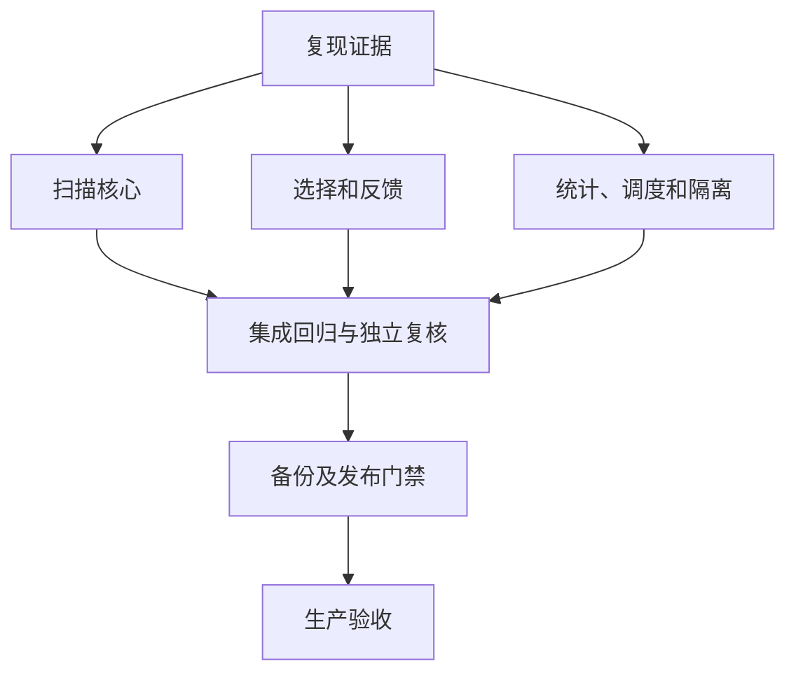

# 生产修复与交互闭环：任务分解

| 任务 | 输入 | 输出及验收 | 负责人 |
| --- | --- | --- | --- |
| 扫描核心 | 已复现生命周期和输入问题 | 后端回归、快照迁移、状态及覆盖闭环 | 主代理 |
| 选择与提交 | 八项前端复现 | 范围/分页/竞态/批量/重入/轮询测试 | 前端子代理 |
| 统计适配 | 三来源计数复现 | 真实统计及列表详情回归 | 统计子代理 |
| 调度与元数据 | DB 与运行时配置分离 | 即时调度同步、全模型元数据测试 | 调度子代理 |
| 交互体验 | 登录和扫描弹窗 | 移除未证实状态、真实忙态及错误恢复 | UI 子代理 |
| 数据隔离 | 已确证测试项目清单 | dry-run、显式校验、可逆隔离及权限测试 | 数据子代理 |
| 集成验收 | 各自回归通过 | 全量回归、构建、迁移、独立复核 | 主代理及独立复核 |
| 生产验收 | 备份、版本、授权齐备 | 恢复验证、发布和真实认证验收 | 主代理 |
| 总览可信反馈 | 已复现错误健康徽章、空态误报及 403 轮询 | 独立状态、单分区重试、40 项回归；已完成 | UI 子代理 |
| 发布链防回退 | 默认版本漂移、回滚版本及恢复镜像风险 | 新增 19 项及完整 Shell 回归通过，主代理复跑源码 SHA 不变；已完成本地验证 | 发布子代理 |
| 本轮数据复算 | 2782 项后端、575 项前端和登录审计回显 | XML/JSON/SQLite 原始计数及基线摘要复算一致；已完成 | 独立数据子代理 |

当前实际阻塞：尚未取得明确本地 Git commit 授权；生产浏览器仍停留在登录页。未执行提交、部署、生产迁移或隔离 apply。默认 `.env` 版本漂移已纳入实际发布前后校准与 ops-check 阻断门禁，但尚未在生产校准。

