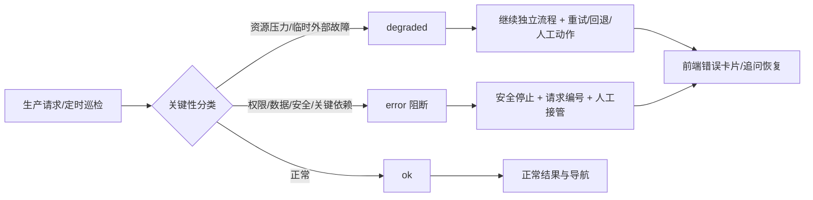
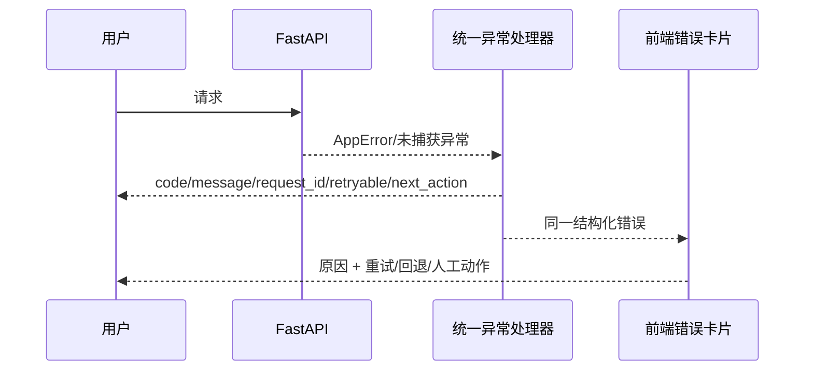

# 生产韧性与人机协同：架构设计

## 总体架构



## 分层设计

### 1. 生产巡检层

`deploy/ops-check.sh` 保留现有只读检查，增加每项 `status`：

- `ok`：通过告警阈值。
- `degraded`：资源超过告警阈值但低于临界阈值，可继续并提示动作。
- `error`：关键依赖失败或资源超过临界阈值，退出 1。

`containers`、`backup`、`alembic`、`https` 是关键检查；`disk`、`memory` 在临界阈值前只降级。顶层 `can_continue` 表示是否允许业务继续，`actions` 提供机器可读和人可读建议。

调度运行时按顺序尝试 `daily@HH:MM`、`hourly@*:MM`、`interval@Nm` 和 `interval@Ns`。秒级表达式限制在 1 秒至 24 小时，避免配置错误形成无限高频任务；不支持的表达式只跳过该任务并记录告警，不杀死主应用。应用启动时回收超过 6 小时仍为 `running` 的任务运行记录，写入可审计的恢复原因，交由管理员决定是否重新运行。

### 2. 应用错误层



`AppError` 的默认行为为不可重试；外部服务、暂时不可用和限流异常显式标记可重试。生产响应只提供安全消息和请求编号，开发/测试保留既有 detail。启动恢复失败本身只记录告警，不阻塞主应用启动，但会在健康结果中暴露需人工处理的状态。

### 3. Agent 交互层

- Responses 流失败：保留已有部分内容与时间线，错误卡片显示结构化原因并提供重试/新建对话。
- Clarify 过期（业务码 41001）：停止重复提交旧 ID，保留表单状态和错误原因，点击“重新提问”后将原用户问题预填并由人确认发送。
- 团队/外部成员操作：统一使用可读错误，失败不清空已有团队状态，保留详情窗口和人工追问入口。
- 安全巡检：逐动作记录 `completed_actions`、`failed_actions` 与 `partial_failure`；单一来源失败时保留已完成结果并允许继续，所有来源失败或关键状态失败时才判为失败。
- FlyTrap：事件解析只接受经 `ipaddress` 校验的 IPv4/IPv6；agent 与 sync 的进程状态、最近错误和最近成功信号独立汇总。上游异常时动作仍进入 `completed_actions`，同时进入 `degraded_actions`，并携带 `human_actions`；恢复后自动关闭同一指纹的集成告警。

## 接口契约

### 巡检 JSON

```json
{
  "schema_version": 1,
  "status": "ok|degraded|error",
  "can_continue": true,
  "summary": "可继续：磁盘压力需要人工清理",
  "actions": [{"code": "disk_cleanup_review", "label": "审阅磁盘清理", "requires_human": true}],
  "checks": {"disk": {"ok": false, "status": "degraded", "used_percent": 87}}
}
```

### 错误 JSON

```json
{
  "code": 50201,
  "message": "外部服务暂时不可用，请稍后重试",
  "request_id": "validated-request-id",
  "retryable": true,
  "next_action": "稍后重试；若持续失败，请将请求编号提供给管理员"
}
```

## 异常处理策略

| 类别 | 行为 | 人工入口 |
| --- | --- | --- |
| 容量接近阈值 | 降级、继续独立业务 | 审阅清理候选/扩容 |
| 网络、外部模型、限流 | 有限重试，保留上下文 | 重试、换会话、联系管理员 |
| FlyTrap 上游超时 | 本地事件/队列继续，巡检降级但不中断 | 检查上游服务、防火墙、路由；恢复后确认成功日志 |
| Clarify 过期 | 不重放旧 ID | 重新提问并确认 |
| 权限/认证/审批 | 安全阻断 | 登录、申请权限、审批 |
| 备份/迁移/HTTPS/容器关键故障 | 发布和关键操作阻断 | 值班人工处置/回退 |

## 稳定发布路径

systemd 单元使用 `/opt/code-review/deploy` 这类稳定部署目录；每次发布后执行单元刷新并重新运行巡检，避免引用已淘汰的 release 目录。
