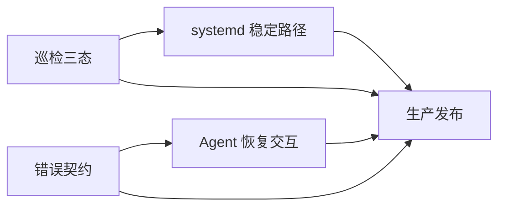

# 生产韧性与人机协同：任务拆分

## 任务清单

| ID | 原子任务 | 输入契约 | 输出契约 | 依赖 | 验收 |
| --- | --- | --- | --- | --- | --- |
| T1 | 巡检三态与阈值 | 当前 `ops-check.sh`、生产状态 | 三态 JSON、退出码、部署脚本测试 | 无 | 资源降级退出 0，关键失败退出 1 |
| T2 | 错误响应元数据 | `AppError`、异常处理器 | request_id/retryable/next_action 契约 | 无 | 开发/生产安全字段测试 |
| T3 | Agent 恢复交互 | Axios 类型、AgentChatDrawer | 可读错误、追问过期人工恢复 | T2 | 前端测试和浏览器验收 |
| T4 | systemd 路径修复 | systemd 模板、安装脚本 | 稳定部署目录和刷新证据 | T1 | 模板/安装预览测试 |
| T5 | 发布与回退 | 备份、Compose、Alembic | 生产新版本、回退点、验收记录 | T1-T4 | 健康、就绪、HTTPS、关键 API |

## 依赖图

## 通用输入约束

- 生产环境必须先有可验证备份和可执行回退脚本。
- 所有改动先写失败测试；测试失败原因记录在验收文档。
- 关键安全与数据一致性行为不得被降级逻辑绕过。

## 输出约束

- 每项任务更新 `ACCEPTANCE_生产韧性与人机协同.md`。
- 生产操作记录提交、镜像、迁移、备份、服务和公网验证证据。
- 未完成外部配置写入 `TODO_生产韧性与人机协同.md`，不伪造完成状态。
