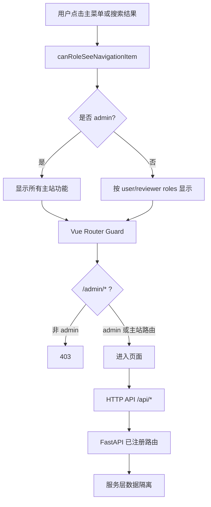

# 用户功能导航与接口接入 - 设计文档

## 导航与权限流

## 模块变更

- `frontend/src/utils/roleHome.ts`：安全站内路径与菜单可见性单一判定源。
- `frontend/src/router/guards.ts`：管理员绕过主站角色限制，非管理员继续受 RBAC 约束。
- `frontend/src/components/layout/AppSidebar.vue`：管理员显示所有主菜单项。
- `frontend/src/components/layout/AppHeader.vue`：搜索项与主菜单共享可见性，补齐六个入口。
- `frontend/src/utils/coreUtils.test.ts`、`frontend/src/router/guards.test.ts`：角色、路由与回归边界。
- `backend/tests/unit/services/test_frontend_api_contract.py`：六类用户功能的显式 API 契约。

## 异常处理

- 无 Token 仍保留原始目标路径并进入登录页。
- 非管理员进入 `/admin/*` 返回 403 页。
- 页面 API 失败继续由全局 HTTP 拦截器与页面 loading/empty 状态处理。
