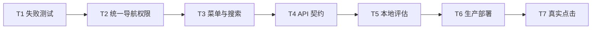

# 用户功能导航与接口接入 - 原子任务

## T1 失败测试

- 输入：现有角色工具和路由守卫测试。
- 输出：管理员可进入主站用户页、菜单可见性和六类 API 契约用例。
- 验收：实现前对现有管理员限制准确失败。

## T2-T4 实现

- 输入：共识中的超级用户语义与安全边界。
- 输出：统一函数、路由守卫、主菜单、搜索项和后端契约测试。
- 约束：不改后端业务代码，不放宽普通用户后台权限。

## T5-T7 评估与部署

- 输入：已通过的代码、测试和部署备份。
- 输出：前端新镜像、容器健康证据、六页面点击与首屏 API 证据。
- 验收：六页面都停留在正确 URL，页面标题和核心内容出现，控制台无新错误。

## 执行状态

- [x] T1 失败测试：复现管理员被送回工作台，修复前新增用例共出现 5 个预期失败。
- [x] T2 统一导航权限：管理员作为超级用户进入全部已认证主站页，普通用户仍禁止进入 `/admin/*`。
- [x] T3 菜单与搜索：侧边栏与全局搜索均显示六个用户功能入口。
- [x] T4 API 契约：显式覆盖七个首屏请求与对应 FastAPI 路由。
- [x] T5 本地评估：前端 50 passed，后端 1040 passed，ESLint、Ruff、生产构建和 `git diff --check` 通过。
- [x] T6 生产部署：Frontend 切换到镜像 `sha256:31979a7bad723832451df41359c3a8e2adef389f3aa3cbdda1de4d0be84f9fe3`。
- [x] T7 真实点击：六页面 URL、内容、数据回填、全局搜索和控制台全部验收通过。
