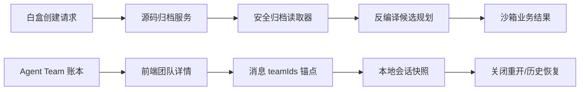

# 设计

## 数据流

## 模块契约

- `read_archive_members(raw, filename, filter_sensitive=False, strict_paths=True)`：返回安全成员；格式错误抛验证异常。
- `plan_decompilation_archive`：普通源码归档 `skipped`，内嵌 Android/JAR 候选按既有规则规划。
- `ChatMessage.teamIds`：仅保存团队 ID，不把团队详情复制进消息正文。
- `refreshAgentTeam`：服务端账本为事实源，首次发现的团队绑定当前运行时间线。

## 异常策略

- 归档解析异常转换为 `DecompilationError`，禁止执行反编译。
- 前端团队列表短暂为空时保留既有详情；下一次同步继续以服务端结果刷新。
- 快照损坏或旧版本无 `teamIds` 时按无关联历史兼容恢复。
