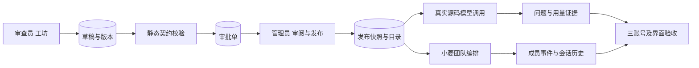

# 真实 Agent 发布与生产闭环设计

## 接口与权限

- 创建、测试、提交：现有 Agent 工坊接口，草稿按所有者隔离；测试为静态检查。
- 发布：仅有 `agent_asset:publish` 的管理员处理精确的 Agent 发布审批单；审批动作必须验证审批单类型、资源和目标版本。
- 调用：已发布目录及 `invoke_published_agent` 复用相同运行服务，服务层再次检查 `custom_agent:invoke`。
- 团队：小菱 `create_agent_team` 以精确的 `custom:<code>` 和已发布快照创建可追踪成员；成员失败应显式记录，不以最终摘要代替运行轨迹。

## 异常与证据

归档会话的心跳 409 应收敛该会话而继续其他收件箱；首次恢复的浮动窗口应定位在视口内。异常退出后按服务器会话与消息重建，不凭本地旧索引推断持久化成功。UI 截图、可核对的对象 ID、运行提交与实际模型响应分开保留。
