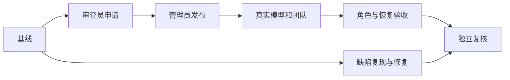

# 真实 Agent 发布与生产闭环任务

| 任务 | 输入契约 | 输出与验收 | 依赖 |
|---|---|---|---|
| 生产基线与真实源码 | `/healthz`、运行提交、审查员项目列表 | 版本一致，真实源码路径和哈希可复核 | 无 |
| 审查员申请 | 工坊权限、Agent 职责和固定 Issue 契约 | 草稿 v1 静态通过、待审批，刷新后可见 | 基线 |
| 管理员发布 | 精确审批单、能力范围与实际点击确认 | 发布号、版本、目录一致 | 申请 |
| 真实模型和团队 | 发布快照、真实源码、小菱会话 | Agent 真实模型结果、用量、团队事件与总结 | 发布 |
| 角色与恢复验收 | 三账号、会话和团队对象 ID | 正反向权限、隔离、顺序、刷新及异常恢复矩阵 | 模型和团队 |
| 缺陷修复 | 先复现的具体错误及现有测试 | 最小修复、回归通过、生产状态明确 | 可并行于审批等待 |
| 独立复核与闭环 | 验收矩阵、源码、版本和证据 | 独立核数、最终报告和精简待办 | 全部 |

