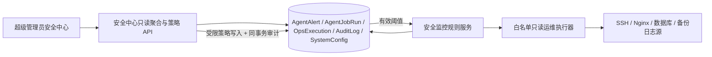

# 管理员安全中心设计

## 架构

## 组件与数据流

- 安全中心前端只调用 admin 安全中心接口和现有服务器状态接口；首页采用盾牌视觉、资源概览、监控覆盖与事件时间线。
- 时间线合并五类系统证据：`AgentAlert`（检测规则告警）、`AgentJobRun`（巡检运行）、`OpsExecution`（只读采集回执）、`AuditLog`（登录、角色/权限、用户/模型配置变更及运维来源）。运维回执按请求 ID 关联审计来源，不读取不存在的 `OpsExecution.source` 字段。每条数据返回 `recorded_at`、`event_type`、`severity`、`status`、`actor`、`summary`、`evidence_summary`，不回显登录异常和操作审计自由文本。
- 无事件原始时间戳时，以 `recorded_at` 标示记录/采集时间，并在 UI 说明它不是原始攻击时间。
- 运行时策略从 `SystemConfig.security_monitor_policy` 读取；缺省字段回退到 Settings。写入服务做校验：阈值只能降低或保持、时间窗只能延长或保持。最低弹窗严重度只读；禁用监控与响应动作字段不可写。
- Nginx 观察窗口使用独立 `security_nginx_window_hours` 环境基线。巡检周期展示以数据库 `AgentJob.schedule` 为准，未知格式原样提示，不冒充环境配置值。
- 手动巡检与安全状态读取复用既有 super_admin API，真实操作者和 `admin_security_center` 来源贯穿只读采集审计；定时巡检沿用 `scheduler` 来源。

## 安全与错误处理

- API 统一 `require_super_admin`。事件 feed 只输出白名单字段；不返回 `params_json`、完整 `result_json`、原始错误栈或未脱敏模型输出。
- 处置备注是附加证据，不替换原告警证据。
- `巡检成功`只意味着本轮数据源与规则流程完成；不代表没有攻击。失败或缺失数据源必须作为覆盖盲区显示。
- 已有 AuditLog 记录可展示；不是所有只读管理 API 都写入 AuditLog，所以有效凭据产生的未审计只读访问可能不会进入时间线。UI 明示此范围，不将空列表解释为安全证明。
- UI 分别处理 loading、无记录、请求失败、上次结果过期；接口失败不得以默认绿色/0 假装健康。
- 策略改动提交失败时事务回滚；写入审计不可缺省。未来新增封禁、服务隔离、密钥轮换等 critical 动作需要独立审批/回滚契约，本次不实现。
