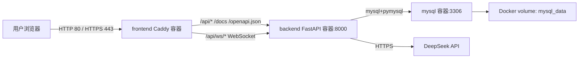

# DESIGN_腾讯云服务器部署

## 部署架构



## 服务器目录

```text
/opt/code-review/
├── backend/
├── frontend/
└── deploy/
    ├── .env
    ├── docker-compose.yml
    └── mysql/
```

## 数据流

1. 用户访问 `http://81.70.251.90`。
2. Caddy 返回 Vue SPA 静态文件。
3. 前端请求 `/api/*`，Caddy 转发到 `backend:8000`。
4. 后端通过 Compose 网络访问 `mysql:3306`。
5. AI 审查功能通过后端访问 DeepSeek API。

## 异常处理策略

- Docker 未安装：通过系统源安装 `docker-ce` 与 `docker-compose-plugin`。
- 构建失败：查看 `docker compose logs backend frontend mysql`。
- MySQL 初始化失败：保留卷并先定位日志，不直接删除数据卷。
- 公网不可访问：区分本机服务状态和腾讯云安全组/防火墙问题。
