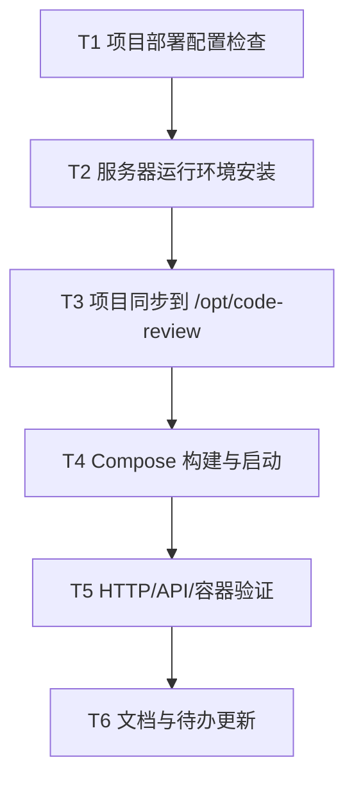

# TASK_腾讯云服务器部署

## 任务依赖图

## 原子任务

| 任务 | 输入契约 | 输出契约 | 验收标准 |
|---|---|---|---|
| T1 配置检查 | 本地仓库、`deploy/.env` | Compose 配置可解析 | `docker compose config` 成功 |
| T2 安装环境 | root SSH 权限 | Docker 与 Compose 可用 | `docker --version`、`docker compose version` 成功 |
| T3 同步代码 | 当前工作区 | `/opt/code-review` 最新代码 | 服务器存在 `backend/frontend/deploy` |
| T4 启动服务 | Docker、项目文件、`.env` | 三容器启动 | `docker compose ps` 显示运行 |
| T5 验证服务 | 公网 IP、容器状态 | 前端/API 可访问 | HTTP 200 与后端健康验证 |
| T6 更新文档 | 验证结果 | ACCEPTANCE/FINAL/TODO | 文档记录真实状态 |
