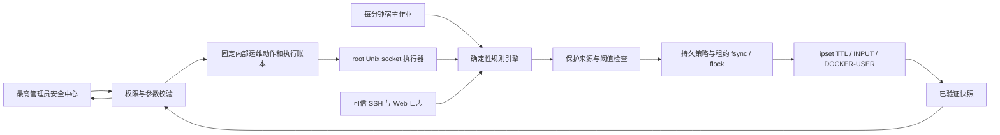

# 自动封禁架构

## 实现约束

复用已存在的运维鉴权、请求幂等账本和审计。独立 root 状态不因应用重启丢失；状态查询校验实际内核，异常不得冒充可用。单 IP、临时封禁且使用 argv 调用，不提供模型可操控 shell 或任意目标地址接口。

Web 容器入口已 DNAT，单独 INPUT 不覆盖容器发布端口。因此 DOCKER-USER 只限制原始入站方向的 TCP 80/443，避免误丢业务出站响应。IPv4 与 IPv6 分别预检，缺少能力时拒绝对应执行并报告。

错误分为拒绝、失败与结果未知。无真实验证回执不展示 active；写入失败禁止随后修改内核；执行部分失败回滚本次规则。策略关闭停止新增封禁并解除自有集合中的现有租约，解除结果必须核验；手动解封提供理由。

## 用户追加：小菱主动研判

用户补充：虽然是规则触发，小菱发现异常也能主动封禁。

新增单独可配置的 `ai_anomaly_enabled`，默认关闭。宿主规则引擎提供带有效期的可信候选，小菱只收到候选编号、类型、计数、不同目标数量与时间范围，不收到实际 IP、账号、请求正文或原始日志。小菱可选择候选并说明理由；内部固定提交链路重新读取日志、校验候选、保护地址与租约，任何不完整/幻觉编号均拒绝执行。

为了让主动研判具有明确的独立作用，SSH 至少 10 次真实密码失败，或 Web 至少 10 次且 3 种敏感目标的候选，可以被小菱提前处置，但最长 120 秒（不超过当前策略期限）。常规确定性规则仍使用管理员设定的 20/30 默认阈值，最长 900 秒。AI 不能更改门槛或自行扩大范围。模型失败时仅观察，不封禁。

每次最多 3 个候选、每天最多 24 次研判，同一证据去重，走既有模型配置与用量记账。不增加模型任意封 IP 工具；高风险永久/批量网段/配置变更仍按既有人工审批。
