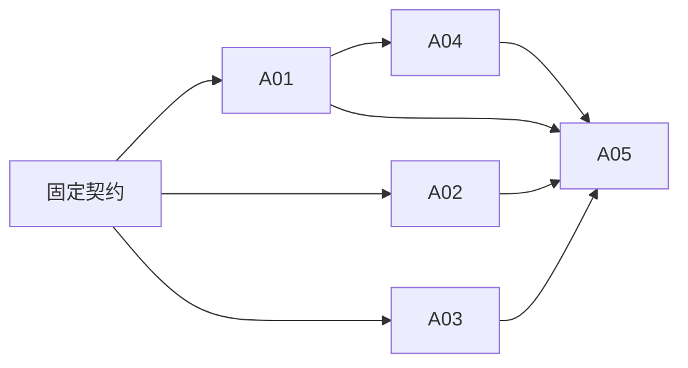

# 自动封禁任务

| 任务 | 输入 | 输出 / 验收 | 负责人 | 依赖 |
|---|---|---|---|---|
| A01 root 规则与临时租约 | 可信日志、root 状态、iptables / ipset | 阈值、保护、幂等、TTL、失败边界测试 | 执行器子代理 | 无 |
| A02 后端专用入口 | A01 固定动作契约、最高管理员认证 | API、参数校验、执行审计、禁止模型直接调用 | 后端子代理 | 契约 |
| A03 安全中心界面 | A02 快照契约 | 策略、保护列表、有效状态、解封与移动布局 | 前端子代理 | 契约 |
| A04 部署与文档 | A01 systemd 模板 | 安装回滚、受保护来源配置、6A 文档 | 总控 | A01 |
| A05 独立复核与发布 | 全部实现与测试 | 明确范围的测试证据、标准生产发布与核验 | 总控与独立子代理 | A01–A04 |

停止门禁：来源不可信、保护地址无法确定、内核能力不足、回执未知、构建/权限/健康检查失败。先记录并修复，不宣称生效。
