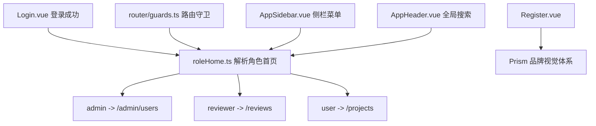
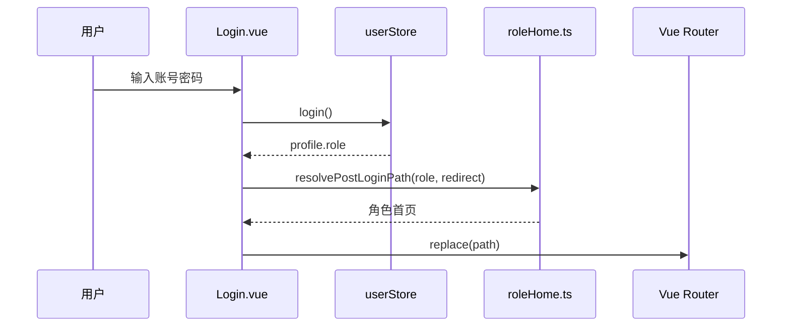

# 角色分流与注册页优化设计文档

## 架构图

## 模块设计

| 模块 | 职责 |
|------|------|
| `roleHome.ts` | 统一角色归一化、默认首页、路径访问判断和登录重定向解析 |
| `Login.vue` | 登录成功后调用角色分流逻辑 |
| `guards.ts` | 根路径、登录页、注册页的登录态分流 |
| `AppSidebar.vue` | 依据角色展示对应导航入口 |
| `AppHeader.vue` | 依据角色过滤全局搜索结果 |
| `Register.vue` | 同步 Prism 视觉与交互样式 |

## 数据流

## 异常处理

- 登录前重定向到管理员路径时，若当前登录用户不是管理员，则回退到该角色默认首页。
- 已登录用户访问 `/login` 或 `/register` 时，若恢复用户信息失败，则清理登录态并允许重新登录。
