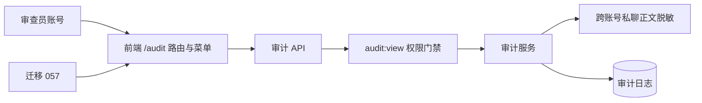

# 账号角色与审计权限设计

## 请求链路

## 权限与失败处理

- API 以 RBAC 权限 `audit:view` 为准，不能仅依赖前端菜单隐藏。
- reviewer 可以查看审计元数据；跨账号私人会话正文仍由服务层脱敏。
- 普通账号缺少权限时后端返回 403，即使手动请求 URL 也不能绕过菜单。
- 迁移记录被修改菜单的 ID 和原路径，降级只恢复这些记录。
- 团队详情按当前用户所有权查询，跨账号请求返回 403 或 404，不泄露对象是否存在。
