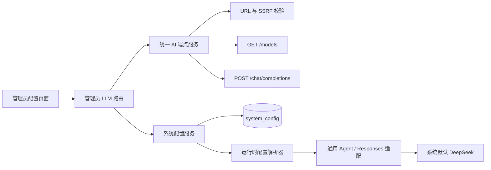
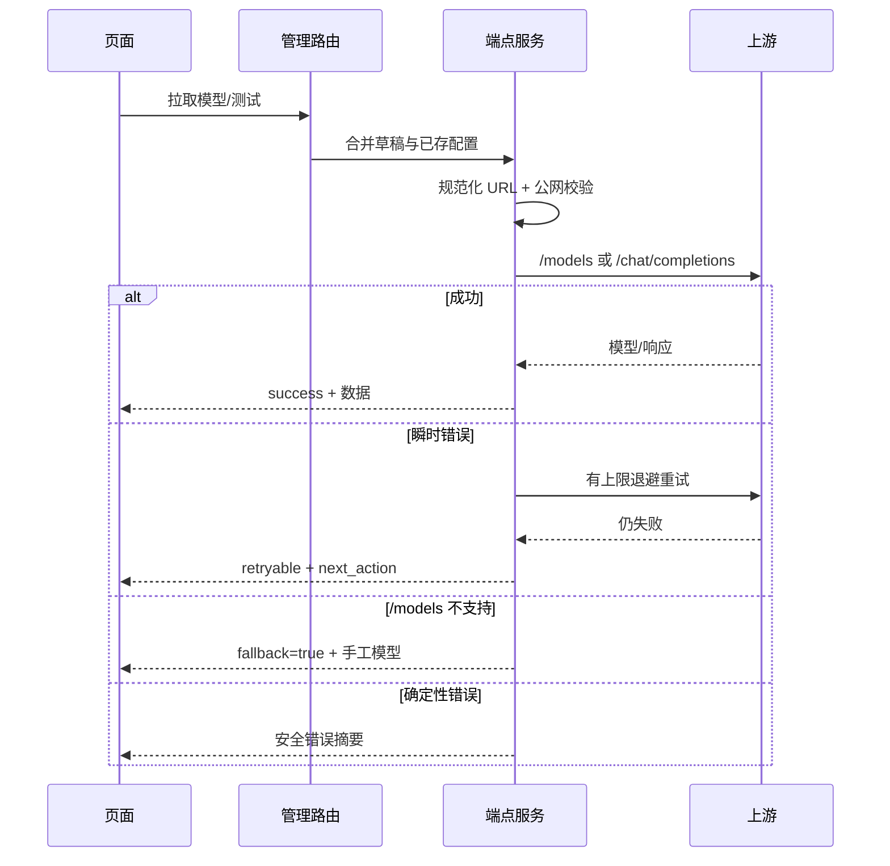
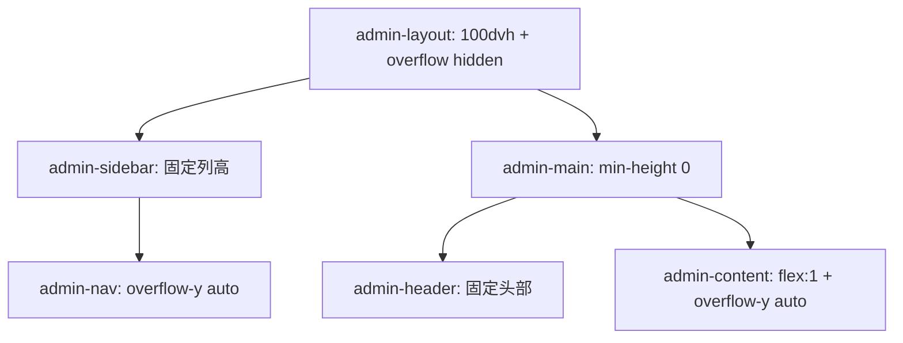

# 通用 AI 接口配置与双栏滚动隔离：设计

## 整体架构

## 分层与职责

| 层 | 组件 | 职责 |
| --- | --- | --- |
| 表现层 | `LlmConfig.vue`、`llmConfig.ts` | 表单、状态、模型选项、错误恢复和人机确认 |
| API 层 | `api/v1/llm_config.py` | 管理员鉴权、请求合并、响应契约、审计 |
| 服务层 | `api_config_service.py` | URL 规范化、请求、重试、状态映射、模型解析 |
| 配置层 | `system_config_service.py` | 加密持久化、默认值、回滚、脱敏 |
| 解析层 | `api_resolver.py` | 用户 > 全局 > 系统默认优先级和安全回退 |
| 运行层 | `BaseAgent`/`DeepSeekAgent` | 将有效运行参数应用到模型请求 |
| 布局层 | `AdminLayout.vue` | 固定视口、独立滚动、路由复位 |

## 接口契约

### `GET /api/admin/llm/config`

返回 provider、base_url、model、active、api_key_masked、is_set、source、timeout_seconds、max_retries、temperature。

### `PUT /api/admin/llm/config`

接受上述可编辑字段。`api_key=null` 保留已存密钥，空字符串清除密钥；后端先校验并在提交失败时回滚。

### `POST /api/admin/llm/models`

请求可携带未保存的 base_url/api_key/provider/timeout_seconds/max_retries；缺省字段从已保存配置补齐。响应包含 `success`、`models`、`selected_model`、`message`、`duration_ms`、`fallback`。

### `POST /api/admin/llm/test`

请求可携带未保存字段。响应沿用 `ApiConfigTestOut`，新增 `attempts`、`retryable`、`next_action`，兼容旧客户端字段。

## 请求与错误流程

## 回退矩阵

| 场景 | 服务端行为 | 页面行为 | 业务影响 |
| --- | --- | --- | --- |
| `/models` 200 | 解析、去重、排序、限制数量 | 更新下拉并保留当前选择 | 正常 |
| `/models` 404/405/501 | 不重试，回退手工模型 | 显示警告，可继续测试/保存 | 不阻断 |
| 401/403 | 快速失败 | 提示检查 Key/权限 | 不自动重试 |
| 429/5xx/超时 | 0-5 次退避 | 显示尝试次数和重试入口 | 可继续 |
| URL/SSRF/参数错误 | 快速失败 | 定位字段并保留输入 | 不发起上游请求 |
| 全局配置解密/JSON 异常 | 记录安全摘要并回退默认 | 来源显示为系统默认 | 主业务继续 |
| 旧覆盖已停用或 Key 不可用 | 选择系统默认为有效草稿来源 | 展示真实默认端点/模型与脱敏 Key 状态 | 默认端点可继续拉取/测试 |
| 草稿切换到其他端点 | 不复用系统或旧端点 Key | 要求重新填写该端点 Key | 防止凭据跨端点发送 |

## 滚动隔离设计

路由变化时对 `admin-content` 执行 `scrollTo({ top: 0 })`；`overscroll-behavior: contain` 防止滚动链把页面带到 body 或另一列。

## 安全与可观测性

- 所有上游请求使用 `trust_env=False`、固定公网 DNS 目标和 Host/SNI 隔离。
- 日志只记录 provider、状态码、尝试次数、耗时和错误类型；不记录 URL 中的凭据或请求头。
- 审计记录只写字段变更摘要；模型列表结果不写入密钥或完整响应。
