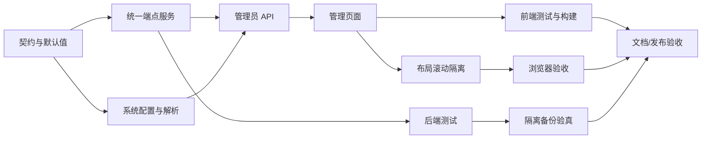

# 通用 AI 接口配置与双栏滚动隔离：原子任务

## 任务依赖图

## T1：契约与默认值

- 输入：现有 schema、settings、配置 JSON。
- 输出：新增字段的边界、向后兼容默认值。
- 验收：非法 provider/数值被拒绝；旧 JSON 可读取。

## T2：统一端点服务

- 输入：规范化配置。
- 输出：模型列表和连接测试结果。
- 验收：成功、空列表、404 回退、401、429、5xx、超时、传输错误均有确定结果；Key 不泄露。

## T3：系统配置与解析

- 输入：管理员保存请求和旧配置。
- 输出：加密持久化、脱敏配置、运行时 `ApiConfig`。
- 验收：提交异常回滚；全局异常回退系统默认；timeout/retry/temperature 传递正确。

## T4：管理员 API

- 输入：管理员认证请求。
- 输出：`/config`、`/models`、`/test` 响应与审计。
- 验收：权限隔离、旧客户端兼容、错误含下一步动作。

## T5：管理页面

- 输入：API 契约。
- 输出：完整可交互表单、模型下拉、状态提示、重试/恢复默认。
- 验收：加载/保存/测试/拉取失败均可继续；输入不丢失；Key 不回显。

## T6：布局滚动隔离

- 输入：现有管理布局和路由。
- 输出：固定外壳、独立滚动、路由回顶。
- 验收：桌面和移动视口无 body 双滚动；两区域滚动互不改变。

## T7/T8/T9：验证

- 后端定向 pytest、前端 Vitest、vue-tsc/vite build、Playwright 公网页面或本地预览。
- 每项记录通过、失败或受环境阻断的证据，不将未测试写成通过。

## T10：隔离备份验真

- 输入：生产备份、备份元数据和专用 `cr_testdb` 验证容器。
- 输出：在非生产数据库中的可恢复性、表数量、迁移版本和归档表验证结果。
- 验收：脚本拒绝生产 MySQL 目标；资源门禁不足时安全退出；无论成功或失败均清理临时验证库；不错误释放其他流程持有的维护锁。

## T11：文档与发布验收

- 输入：所有实现、测试与生产验证证据。
- 输出：验收记录、最终报告和仅保留真实未决事项的待办。
- 验收：版本、生产提交、容器镜像、数据库迁移和浏览器结果相互一致。
