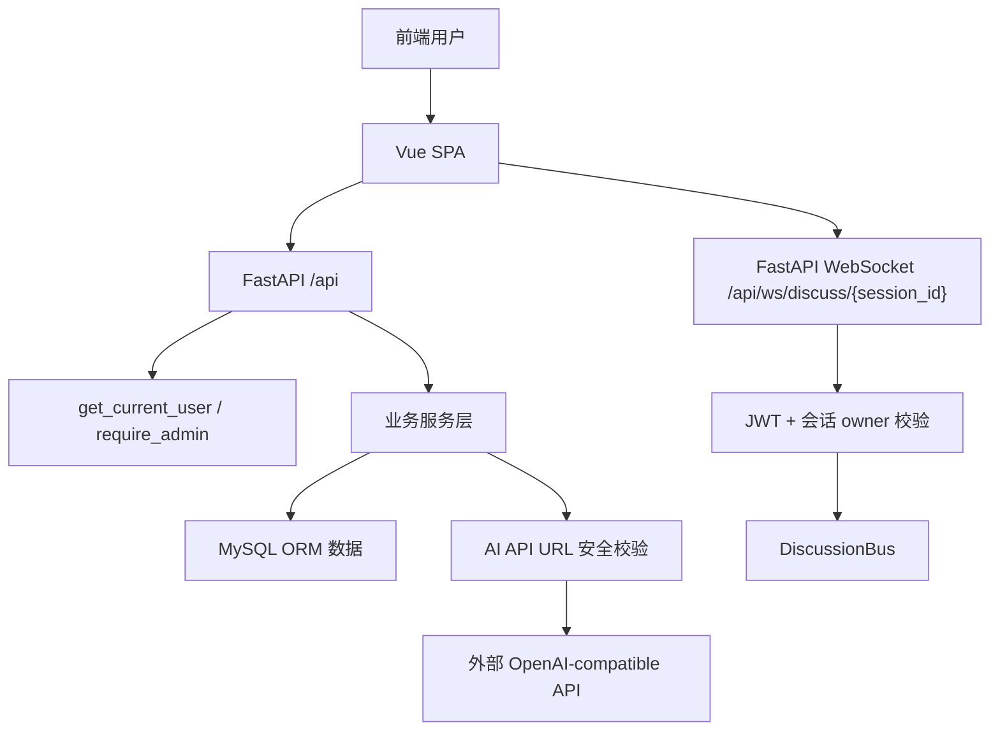
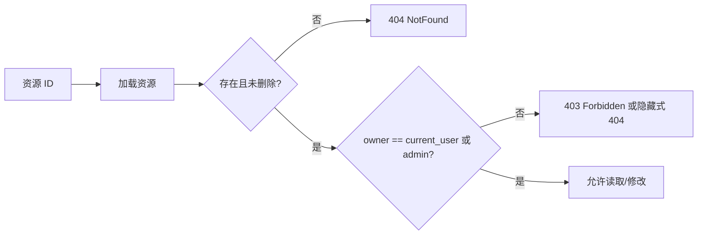
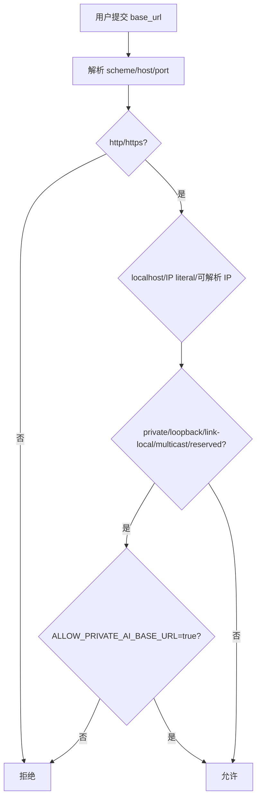

# DESIGN_逻辑漏洞与全量优化

## 总体架构

## 分层设计

- API 层：继续负责认证依赖注入、参数校验和响应包装。
- 服务层：集中对象级授权，避免列表接口安全而详情/写接口漏检。
- 工具层：新增 AI API base URL 安全校验工具，供保存、测试、运行时解析共同使用。
- WebSocket 层：解码 JWT 后加载当前用户，校验会话 owner/admin，再允许订阅。
- 前端层：收紧登录 redirect 与外链安全属性，不作为真实授权边界。
- 部署层：Caddy 恢复 HTTPS-only 策略。

## 授权策略

## SSRF 防护策略

## 接口契约变化

- `rule_service.toggle_rule/update_rule/delete_rule` 增加 `user: User` 入参。
- `issue_service.get_issue` 增加 `user: User` 入参并校验任务归属。
- `review_service.list_task_issues` 增加任务归属和 deleted 状态校验。
- `DiscussionSession` 增加 `owner_user_id` 字段。
- `api_config_service` 在保存和测试连接前调用 URL 安全校验。
- `resolve_api_config` 对数据库内已有配置做二次校验，非法时回退系统默认。

## 异常处理

- 越权读取他人任务/问题详情时优先隐藏资源存在性，返回 `NotFoundError`。
- 越权修改规则、讨论会话连接、普通写操作返回 `ForbiddenError` 或 WebSocket close code `4003`。
- SSRF URL 校验失败返回 `ValidationError`，错误信息不包含 API Key。

