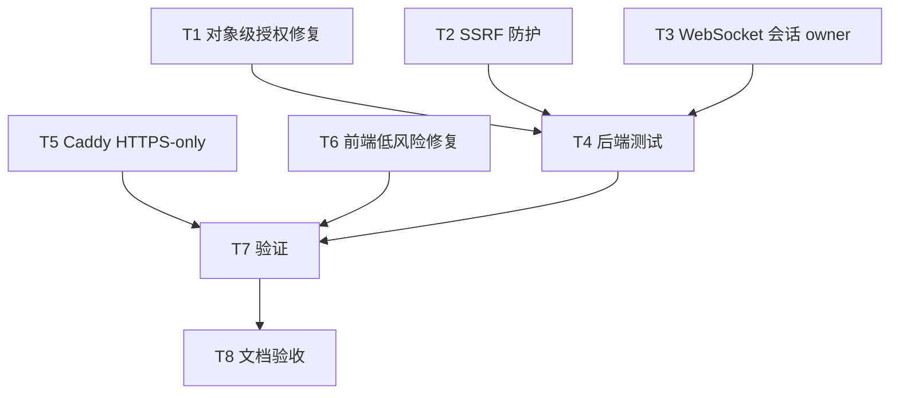

# TASK_逻辑漏洞与全量优化

## 任务依赖图

## T1 对象级授权修复

- 输入契约：现有 `User`、`ReviewTask`、`ReviewIssue`、`ReviewRule` ORM 和异常体系。
- 输出契约：任务问题、问题详情、规则写操作均执行 owner/admin 校验。
- 验收标准：越权访问测试返回异常，合法 owner/admin 仍可操作。

## T2 SSRF 防护

- 输入契约：用户提交的 `base_url`、系统默认 `DEEPSEEK_BASE_URL`、用户配置解析器。
- 输出契约：新增统一 URL 校验函数，默认阻止本机/内网/链路本地/组播/保留地址。
- 验收标准：localhost/private URL 测试失败，公网 HTTPS URL 测试通过。

## T3 WebSocket 会话 owner

- 输入契约：JWT、`DiscussionBus` 会话、`/api/discuss/start` pending 注册。
- 输出契约：讨论会话绑定 owner，WS 订阅时要求 owner 或 admin。
- 验收标准：owner/admin 判定函数单测通过，讨论预检越权测试通过。

## T4 后端测试

- 输入契约：`backend/tests` 现有 SQLite fixture。
- 输出契约：新增权限和 URL 校验单测。
- 验收标准：新增测试和相关既有测试通过。

## T5 Caddy HTTPS-only

- 输入契约：当前 `frontend/Caddyfile` 与 HTTPS-only 文档约束。
- 输出契约：HTTP 全量永久跳转 HTTPS，HTTPS 入口启用 HSTS。
- 验收标准：`caddy` 配置文本不再直接服务 HTTP 应用。

## T6 前端低风险修复

- 输入契约：`roleHome.ts` 与外链组件。
- 输出契约：拒绝协议相对 redirect；外链补齐 `rel="noopener noreferrer"`。
- 验收标准：前端构建通过。

## T7 验证

- 输入契约：本地 Python venv、Node 依赖。
- 输出契约：运行测试、lint、compile、build。
- 验收标准：命令通过或明确记录阻塞。

## T8 文档验收

- 输入契约：本次实现和验证结果。
- 输出契约：`ACCEPTANCE`、`FINAL`、`TODO` 和 `说明文档.md` 更新。
- 验收标准：文档与代码事实一致，TODO 精简明确。

