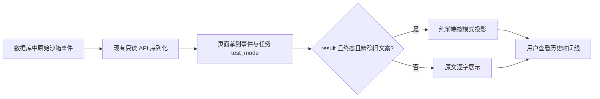

# 设计：部署诊断与历史终态兼容

## 数据流

## 接口契约

新增 `sandboxEventMessage(event, testMode)`，输入事件类型、阶段、正文及任务模式，返回显示文本；不得改变事件对象或持久化数据。仅识别旧 Worker 已证明的“白盒测试完成/白盒测试失败”，分别在黑盒和组合模式下映射到对应模式文本。

## 异常与边界

- 未知模式、缺失字段、相近但不完全相等的正文一律保留原文。
- 运行阶段的历史兼容仍由现有 `stageLabel` 处理，与终态正文映射互不替代。
- 部署前若候选目录不 clean、SHA/CI 不一致、备份恢复失败、迁移或健康检查失败，停止发布并保留诊断证据。

