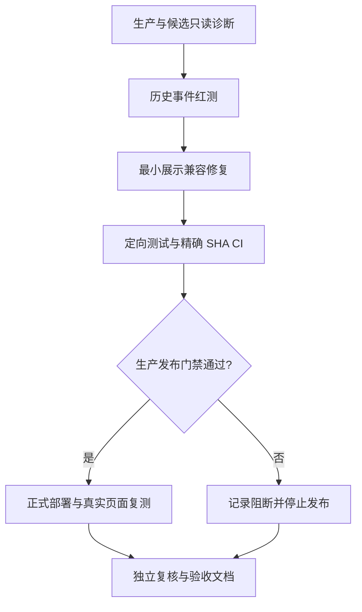

# 任务：部署诊断与历史终态兼容

| 顺序 | 子任务 | 输入 | 输出与验收 |
|---|---|---|---|
| 1 | 核对生产版本、远端分支、候选树、CI 与发布失败门禁 | 生产健康响应、Git refs、CI、deploy 脚本 | 记录当前运行 SHA 和阻断原因，不暴露凭据 |
| 2 | 先写历史事件兼容回归测试 | `SandboxEvent` 与任务 `test_mode` | 黑盒/组合映射、白盒保留、非终态/未知文案不变；先红后绿 |
| 3 | 实现只读展示映射和版本更新 | 干净 v4.0.85 发布树 | 页面展示正确且不改 API/DB/audit；局部测试通过 |
| 4 | 完成质量门禁和精确 SHA CI | 候选提交 | 前端测试、lint、类型、构建及仓库 CI 通过 |
| 5 | 正式部署并真实刷新历史任务 | 已授权生产环境、正式部署通道 | 发布账本、备份/恢复、迁移、运行 SHA、健康/HTTPS、旧任务文案一致 |
| 6 | 更新验收与未决事项 | 全部日志和复核证据 | 不把缺失的服务器或角色验收写成通过 |

