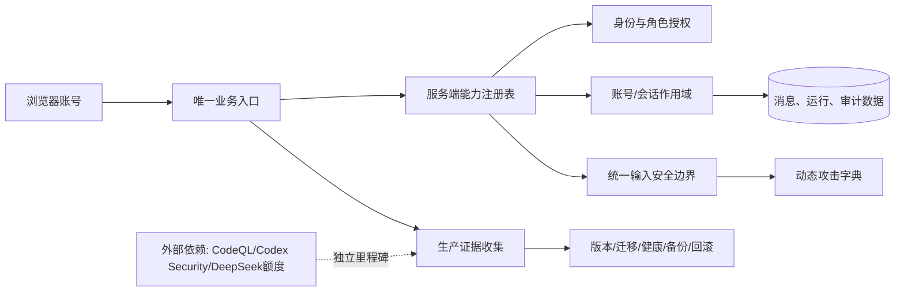

# Prism 需求收敛与可交付拆分设计

## 1. 系统边界



## 2. 事实源与接口契约

| 能力 | 唯一事实源 | 必须验证 |
| --- | --- | --- |
| 菜单与旧路径 | 前端路由注册表 + 服务端能力注册表 | 新入口唯一、旧入口只跳转、权限同源 |
| 角色 | `user.role` 与有效核心角色关联 | 一个账号一个有效核心角色，历史关联不授权 |
| 渗透授权 | 授权申请/审计记录 | 申请、批准、取消、删除、403 和审计主体一致 |
| 小菱历史 | 服务端会话表/消息表 | 查询条件包含账号、面、键；归档不删除消息 |
| 支持工单 | 统一支持工单模型 | 反馈和维修只由类型字段区分，列表和权限不分叉 |
| 输入安全 | 请求 Schema + 统一清洗/拒绝策略 | 控制字符先拒绝，纯标签值不得清洗为空，错误信息稳定 |

## 3. 输入安全测试契约

每个表单字段按以下字典生成测试，不改变生产数据：

```text
SQL: ' OR 1=1--, "; DROP TABLE test;--
XSS: <script>alert(1)</script>, 
模板: {{7*7}}, ${7*7}, <% 7*7 %>
控制字符: NUL, CR, LF, TAB, C0/C1 控制字符
边界: 空值、空白、255/256 字符、超大 JSON、重复 Unicode、组合字符
路径/编码: ../、%2e%2e/、NUL 拼接、前后端不同编码
```

通过条件是：拒绝或安全编码；不产生 500、SQL 语法泄漏、HTML 执行、模板求值、越权写入或日志凭据泄漏。密码长度按密码字段实际约束验收，不以“数据库允许 255”作为安全标准。

## 4. 证据产物

每一项输出一条证据记录：账号与角色、URL、请求/响应摘要、期望结果、实际结果、截图路径、日志或测试 ID、时间和 SHA。敏感账号、密码、令牌和原始授权标识不得进入知识库正文。

## 5. 失败处理

- 关键失败：停止发布、保留备份和失败请求 ID，修复后从失败项重跑。
- 非关键外部服务失败：保留已完成扫描结果，记录 `blocked` 和依赖，不伪装为清零。
- 数据归属不清：只读导出关系和软停用候选，不删除。

