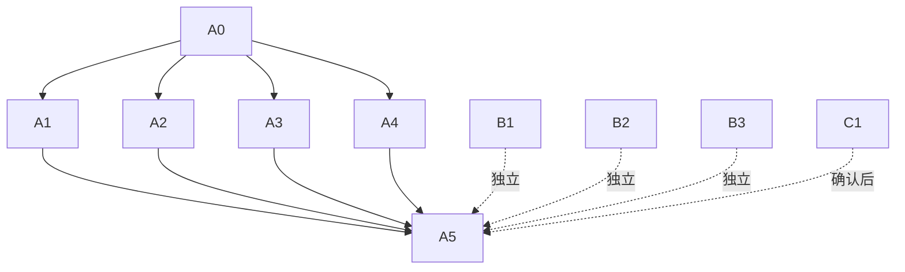

# Prism 需求收敛与可交付拆分任务

## A 类：本次发布闭环

| 编号 | 原子任务 | 输入 | 输出/验收 | 依赖 |
| --- | --- | --- | --- | --- |
| A0 | 冻结唯一入口和角色合同 | 3.9.9 当前路由、能力注册表、角色迁移记录 | 路由/能力/角色清单；禁止新增同级重复入口 | 无 |
| A1 | 三角色生产浏览器矩阵 | admin、reviewer、user、super_admin 账号 | 四管理中心、Agent 工作台、安全、支持中心逐页截图；正向、403、旧路径、空态、失败和响应式均有结论 | A0 |
| A2 | 动态输入攻击字典 | 表单字段清单、隔离测试项目 | 登录/注册/项目/聊天/反馈/论坛/规则配置矩阵；无 500/执行/越权/泄漏 | A0 |
| A3 | 小菱会话回归 | 两个账号、两个会话面、11 条边界样本 | 新对话标题、历史准确、重登浮窗、跨账号隔离、10 条活跃归档和消息保留 | A0 |
| A4 | 支持中心唯一入口回归 | `/support` 与旧反馈/维修地址 | 两种类型共用列表/接口/权限；旧地址仅跳转 | A0 |
| A5 | 发布门禁与回滚 | A1-A4 证据、备份、迁移 | 测试、构建、health/ready、版本/SHA、备份恢复、回滚点均记录 | A1-A4 |

## B 类：独立依赖里程碑

| 编号 | 原子任务 | 外部依赖 | 完成定义 |
| --- | --- | --- | --- |
| B1 | 平台上传项目 CodeQL 执行器 | CodeQL CLI/许可、隔离 worker、SARIF 规范 | 上传项目可安全执行，SARIF 入库、去重、报告合并和权限隔离有真实证据 |
| B2 | Codex Security 标准/深度扫描 | 受管只读文件系统权限、扫描服务 | 标准与深度结果、去重和风险说明可交付；权限不足时保持阻塞 |
| B3 | DeepSeek 全项目真实回归 | 预算、并发/限流、供应商上下文上限 | 完成覆盖账本；截断有重试/续跑，失败分片保留，不能只用“1m”配置值证明通过 |

## C 类：确认后执行

| 编号 | 原子任务 | 前置确认 | 完成定义 |
| --- | --- | --- | --- |
| C1 | 测试/演示数据治理 | 账号、项目、任务、会话的归属清单 | 只对确认归属数据软停用/归档；导出前后计数、关系和审计可追溯 |
| C2 | 角色内部枚举变更（可选） | 用户确认是否迁移代码枚举 | 有迁移、回滚和全部权限回归；默认不执行 |

## 依赖图

